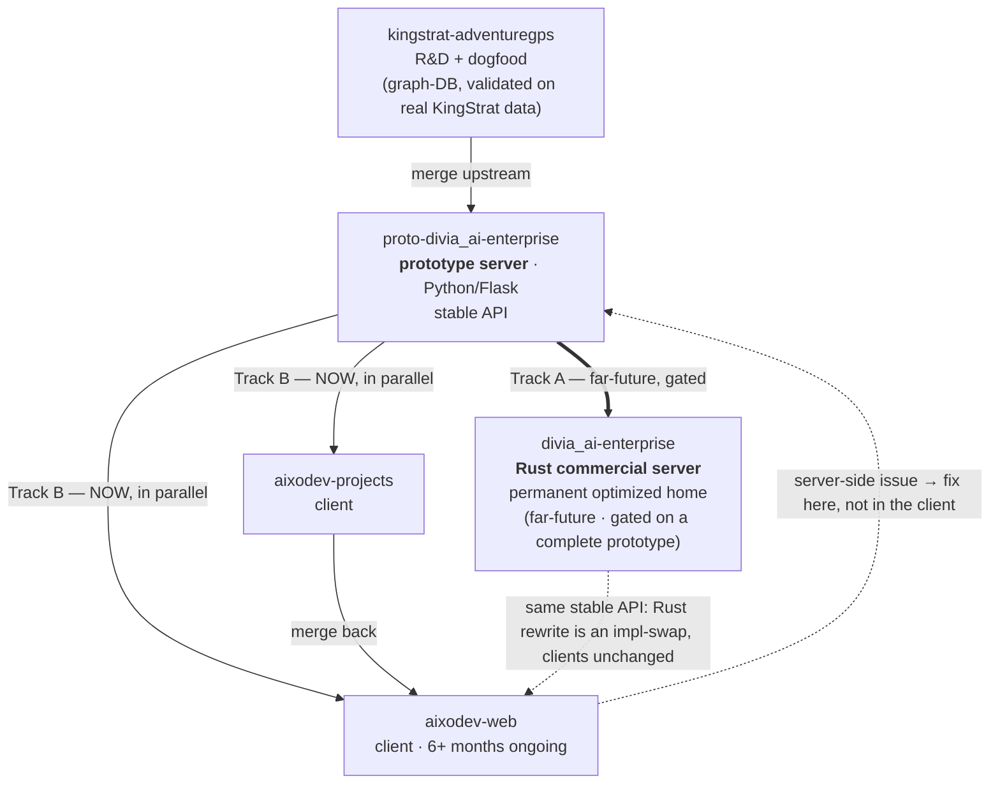

# Architecture: Core-Functionality Convergence & the Divia.AI Enterprise Server

> How shared / core functionality across the portfolio converges into **one** optimized home — the **Divia.AI Enterprise server** — instead of being re-implemented in every project, and how downstream products depend on it (as clients) while it evolves from a Python/Flask prototype into a Rust commercial server.

- **Provenance:** John, 2026-06-16 MetaProject session (articulated while centralizing cross-project workflows). The full working-context capture lives in [`_backlog_TODOs/LATER-001`](../_backlog_TODOs/LATER-001-workflow-lineage-and-hybrid-formalization.md); this doc is the clean, durable statement of the architecture.
- **Nature:** forward-looking *design intent*. Parts are not yet built — see **Status** at the end. This is the canonical picture; where an individual repo's older docs imply a different (e.g. linear) dependency, this is the intended source of truth.

## The principle

Across 20+ projects, the same core capabilities (graph-database, knowledge model, task management, research-documentation handling) kept getting re-described — and would, if left alone, get re-implemented — in five different repos. The intent is the opposite: **concentrate each core capability's optimization in ONE place** (the Divia.AI Enterprise server) and let every other product **depend on it as a client**, rather than maintain ~5 parallel versions of the same functionality. Two payoffs:

- **Optimize once, where it's most effective.** Graph-DB performance work (and similar deep optimization) happens in the server, not redundantly per-app.
- **Business requirements double as the engineering validation set.** Entering the *actual* KingStrat companies / entities / domains into the graph *is* the graph-DB acceptance test — so "the engineering is correct" and "stakeholders (non-technical staff, investors) see a working KSVGPS service" become the **same** deliverable, not competing efforts.

## The convergence chain

1. **`kingstrat-adventuregps` — R&D + dogfood.** The KingStrat spikes figure out the **graph-DB architecture**, validated by importing KingStrat's own real data (companies / entities / domains — most already sitting in this project's `DOMAIN_*` and `UV_Guide` markdown).
2. **Merge upstream → `proto-divia_ai-enterprise`.** Same Python/Flask stack, so it inherits the DB architecture. This is the **prototype** of the Divia.AI Enterprise server, exposing a deliberately **stable API**.
3. **Branch point — two *parallel* tracks (a "DecisionNode," NOT a sequence):**
   - **Track A — the real server (far-future, gated).** The Rust **`divia_ai-enterprise`** commercial server is built only *after* a complete prototype exists (that is the prototype's reason to exist), so it is far off. It is the **single, permanent, optimized home** of the core.
   - **Track B — clients, NOW, in parallel.** `aixodev-projects` and `aixodev-web` build directly against the **prototype immediately**, *not* blocked on Track A. The **stable API is the contract**: when Track A's Rust rewrite lands, it is an implementation-swap *behind the same API*, so clients do not change.
4. **Issue-routing keeps client scope clean.** When client work (e.g. `aixodev-web`, 6+ months ongoing) surfaces a server-side issue, it is fixed **in `proto-divia_ai-enterprise`** (or noted "already fixed in `divia_ai-enterprise`"), **never duplicated in the client** — concentrating fixes where they belong and elegantly shrinking the client's own scope.
5. **`aixodev-projects` merges back → `aixodev-web`.** `aixodev-web` therefore carries an **intentional, significant dependency** on the Divia.AI Enterprise server — not a thin "client implementation" like kingstrat, but a deep one: much of its task-management and non-technical research-documentation functionality is *really best implemented* server-side (the intent from the start).

## Project roles

| Repo | Role | Stack | Status |
|------|------|-------|--------|
| `kingstrat-adventuregps` | R&D + dogfood site for the graph-DB; also a thin client (KSVGPS app) | Python/Flask | active (Phase 00 spikes this week) |
| `proto-divia_ai-enterprise` | **Prototype** Divia.AI Enterprise server; the stable-API surface clients build against **now** | Python/Flask | the live integration target |
| `divia_ai-enterprise` | **Rust commercial server** — the permanent, optimized home of the core | Rust | far-future (gated on a complete prototype) |
| `aixodev-projects` | Client; spikes shorten to leverage the server, then merge back to `aixodev-web` | Python/Flask | active |
| `aixodev-web` | Client with a deep, intentional server dependency | Python/Flask | active (6+ months) |

## Why the parallel tracks work — the stable-API contract

Track A (Rust) and Track B (clients) proceed independently *because the API is the contract, not the implementation.* Clients code against the prototype's stable API today; the eventual Rust rewrite changes the implementation behind that API, not the API itself, so it forces no client-side changes by itself. This is what lets six-plus months of `aixodev-web` work happen **in parallel** with — rather than blocked behind — the far-future commercial server.

## Status & open questions

- **Built / active:** `aixodev-web` and `aixodev-projects` (clients); `kingstrat-adventuregps` (graph-DB spikes in progress); `proto-divia_ai-enterprise` exists as the prototype.
- **Far-future:** the Rust `divia_ai-enterprise` server (gated on a complete prototype).
- **Open (John's to decide / TBD):** the precise API boundary and versioning policy; how much of the graph-DB *cross-project inventory* (the `{{var}}`-substitution lookup — see LATER-001) lives in the server vs. in `aixodev-projects`; the timing of the Rust rewrite.

## See also

- [`_backlog_TODOs/LATER-001`](../_backlog_TODOs/LATER-001-workflow-lineage-and-hybrid-formalization.md) — the workflow-centralization / templatize-and-deploy thread this chain emerged from (and the graph-DB-as-`{{var}}`-lookup connection).
- Per-project backlog items: `kingstrat-adventuregps` `_horizon_LATER` (graph-DB as the cross-project lookup) and `aixodev-projects` `_horizon_LATER` (re-scope to leverage the server).
