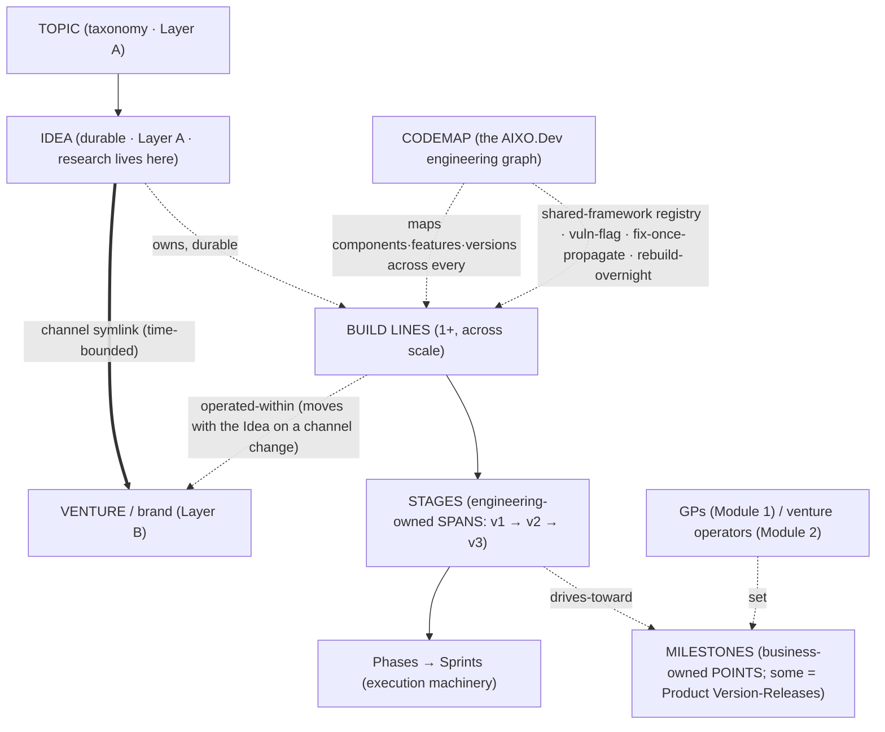

# Codemap & the Shared-Framework Model — the engineering-side companion to the Strategic Landscape

> Reasoning doc (2026-06-22), John + Claude. Reviews the abandoned **`aixodev-codemap`** project and reasons about how a "codemap" capability fits the model we built today: the two layers ([`STRATEGIC-LANDSCAPE-MODEL.md`](STRATEGIC-LANDSCAPE-MODEL.md) = Layer A, business/Module-1) and the Build-Line/engineering structure ([`PROJECT-ORGANIZATION-MODEL.md`](PROJECT-ORGANIZATION-MODEL.md) = Layer B). **Codemap is to the AIXO.Dev *engineering* graph what the Idea/Topic model is to the KSVGPS *business* graph.** Sections 4–5 propose three model refinements (flagged, pending John's confirm); the rest is known facts + derived reasoning.

## 1. What we actually have — `aixodev-codemap` today

The project's own one-liner: *"builds structural call graphs and semantic 'feature inventories' to enable AI-mediated cross-project comparison."* Its signature use case, stated verbatim in its research: **"Which of my 40 repositories implement JWT authentication, and how do their implementations compare?"** — i.e. *exactly* your shared-library example.

- **Vision = four analysis levels:** L0 Portfolio (Projects) · L1 Structural (Files/Symbols/CodeEdges) · L2 Semantic (Features) · L3 Cross-Project (FeatureEquivalence). A 5-stage pipeline: tree-sitter structural extraction → ast-grep pattern detection → Leiden community-detection + LLM labeling → cross-project comparison → web viz + cited Q&A. Storage: SQLite + in-memory igraph (Postgres/Apache-AGE migration deferred).
- **The shared-component vision is the *heart*, and it's already specified:** a **"shared functionality registry"** with named metrics — **Independent Implementation Rate** ("7 of 12 projects roll their own JWT despite a shared lib existing") and **Version Fragmentation Index** — plus **canonical-version selection** ("Project B is the canonical implementation," RS256-vs-HS256 quality verdict) and a **security carve-out** (Rule of Three, but auth/crypto extract at *2* implementations). This *is* your fix-once-propagate / vulnerability-flagging idea, present as these equivalents (the exact phrases aren't used, and the `shared_libraries` table exists but was never populated).
- **Merge-target is explicit:** the Flask app is deliberately shaped to `aixodev-web` patterns; the plan is to migrate codemap into the AIXO.Dev Platform (Postgres, Apache AGE optional).
- **Where it stalled:** abandoned **~6 weeks ago (2026-05-04), right after Sprint 02** — Flask foundation (12-table schema) + Python *structural* extraction (~2,771 LOC, ~140 tests, v0.2.0) got built; the **semantic feature-inventory (Leiden+LLM) and the cross-project comparison — the entire reason it exists — were specified but never written.** Sprint 03 has a plan and zero implementation commits.
- **The "messy mishmash" (the important diagnosis):** the stall wasn't laziness — it was scope vertigo. The **21-track Phase-0 research + 5-part synthesis ran ~168K words for a prototype that scans one Python repo.** It bolts *enterprise-scale* modeling ("150K functions, ~4 hours of GPU embeddings, 1,000-project cost tables," Neo4j/FalkorDB) onto a local SQLite tool whose Phase-1 exit is merely "test with 2–3 Flask projects"; it specifies multi-language Rust/PyO3 and mutation/Pact testing; and it names far-future Triangulation-Targets (**RosettaMQ**, a Rust shared framework, called *"the ultimate realization of the Code Map vision"*; a revived Python **"Scalara Framework"**). This is the literal specimen of *"I just need to parse the damn emails but Codex insists on researching the National-AVM first."* (Notably, the *curated backlog* is disciplined — it pushes Rust/SCIP/RosettaMQ to LATER/SOMEDAY with "prove Python first" hedges; the conflation lives in the **research**, not the plan.)

**One reframing to flag as *external*:** the "codemap = the engineering-side Ontology / knowledge-graph, the AIXO.Dev equivalent of the KSVGPS business graph" framing is **not in the repo** — it lives only in our MetaProject Idea node + memory. The repo frames it strictly as a *code* knowledge graph. That cross-context reframing is *ours, from today* — and it's the most important thing about codemap going forward.

## 2. Known capability set (repo-envisioned + obvious-from-your-description)

**In the repo's vision:** (a) multi-level code analysis (structural call graphs · semantic feature inventory · cross-project comparison); (b) a **shared-functionality registry** with Independent-Implementation-Rate + Version-Fragmentation-Index metrics; (c) **canonical-version selection** ("standardize on this one"); (d) a **security carve-out** that extracts auth/crypto at 2 implementations; (e) **shared-library extraction** via codemods (LibCST); (f) **test→feature bidirectional mapping** (tests migrate with the code they cover); (g) **append-only ScanVersion history** with `stable_id` cross-version tracking; (h) **citation-backed Q&A** (every answer links to code).

**Obvious from your description (the derived layer):** (i) **vulnerability-flagging → fix-once → propagate-to-all-consumers** (the security registry made operational, with an "intensively-retest-then-approve-push" gate); (j) **the new-Build-Line-vs-portfolio-upgrade decision** — codemap surfaces when a needed change means *a new Build Line on a different techstack*, not upgrading every project's DB; (k) **Build-Envelope alignment** — making "all Seed-tier Flask projects share this auth lib" visible and enforceable; (l) **rebuild-a-Build-Line-overnight** from shared components per a sprint plan; (m) **the bidirectional improvement funnel** — a "we should do XYZ" win in one project flows *up* into the shared framework and *out* to all 20+ consumers (the `_workflows`-propagation pattern, for code); (n) **the engineering scoped-projection source** that future-Claude queries ("what shared components exist; cookie-JWT like FracRealHomes or Redis-tokens like Patternicity?").

## 2b. The three kinds of code codemap must distinguish (John, 2026-06-22)

Conflating these is half of what makes "vibe-coded AI" bad. Codemap keeps them separate:

1. **External libraries/frameworks** — public OSS we *consume* (Django, SvelteKit — **and RosettaMQ**, see below). Codemap doesn't own their internals; it tracks **which of our projects use which, at which version**, and keeps their **reference docs available inside the AIXO.Dev Platform** so Claude has direct, consistent access to every supported framework's docs across *all* projects. This is the **context-engineering substrate**: pick proven frameworks and code *within* them — the whole point of a framework (encapsulate + evolve shared functionality manageably) holds for LLMs exactly as for human engineers — instead of raw-coding from scratch per request.
2. **Project-core functionality** — code specific to one project; lives and dies with its Build Line.
3. **Shared internal functionality** — code shared *across our own projects* (e.g. the JWT user-auth in every Python/Flask Build Line). **This is the layer that must be actively managed** — mapped, versioned, and (on a security fix) pushed back out to every dependent project. "Shared" = shared with *our* projects only (everything in `_projects/README` = the engineering-side view of what KSVGPS cares about): the de-facto **AIXO.Dev shared-functionality library, per techstack** (a vetted Python/Flask stack, a vetted SvelteKit stack, …).

**RosettaMQ's dual nature (resolves §7.5).** RosettaMQ is *both* a **venture/product we build** — the Rust successor to the **Scalara Framework** (7 generations, C++→Python, 1995–2012; a cross-language modular framework that transforms legacy code into registered RosettaMQ modules) — *and*, from the AIXO.Dev-projects perspective, **just another external OSS dependency** our projects consume (like Django). No collision: it's the shared-framework *productized as public open-source*. *(Far-future ~3-yr Triangulation Target: a **fine-tuned local LLM trained on RosettaMQ's reference material**, from its expert creators, that scans legacy code and proposes the most elegant best-practice architecture — codemap-scanning as a model capability. Full Scalara/RosettaMQ lineage → its Idea node.)*

## 3. The refined chain (with codemap in place)

## 4. Three model refinements this surfaces (**CONFIRMED 2026-06-22** — folded into the model docs)

### 4a. Stage vs. Milestone — *span* vs. *point*, *engineering* vs. *business*

They are **not** equivalent. A **Stage** is an **engineering-owned span** of maturity within a Build Line (its internal v1/v2/v3 band — "what work happens in this band"), defined by Engineering like the Build Lines themselves. A **Milestone** is a **business-owned point** — a dated checkpoint a **GP (Module 1)** or **venture operator (Module 2)** mandates (the C-level-directive-to-developers, reframed for the venture-studio context). A Stage **drives toward / culminates in** one-or-more Milestones; **some Milestones are public** (= Product Version-Releases), some internal ("demo-ready for the board," "security-hardened for the partner deal"). The relationship is generally many-to-many (a big Milestone can span Stages; a Stage can serve several Milestones), but the headline case is "a Stage culminates in a Milestone."

**Why this slicing wins for the graph:** the **Stage⟷Milestone edge is the KSVGPS(business)⟷AIXO.Dev(engineering) join, expressed at the *execution* level** — Business owns Milestones (the KSVGPS graph, with GP/operator ACL), Engineering owns Stages + Build Lines (the AIXO.Dev graph, with dev-team ACL), and they meet at exactly one typed edge. That gives clean ACL (a GP edits Milestones, not Stages), clean provenance (every Stage answers "which business Milestone am I serving?"), and the existing model's "certain Stages get promoted to Version-Releases" becomes precise: *a Stage culminates in a Milestone, and a public Milestone is a Product Version-Release.* (Alternative slicing I considered and rejected: "Milestone = a dated sub-Stage." It loses the business/engineering ownership split, which is the whole value.)

### 4b. Build Lines attach to the **Idea** (Layer A), not the Venture — they move with it

Per your point: an Idea **owns its Build Lines**, durably, in Layer A. The Build Line is *operated within* whichever Venture currently channels the Idea (Layer B) — as that venture's Business-Line/Product-Line — but when the **channel moves (Venture-A → Venture-B), the Build Lines move with the Idea.** Worked case: the **real-money-CFTC** Idea's Build Line, if its channel moves from CrowdMadness to Patternicity, becomes a Patternicity Business-Line, *same code, new brand.* This refines today's "a Build Line realizes an Idea inside a Venture" → **the realization is durable with the Idea; only its venture-operation is time-bounded** (carried by the same channel-symlink). It stays consistent with "one Idea → several Build Lines across scale" (the AVM Idea owns *both* EstimatePacket and National-AVM lines) and with succession (MobThought's code was abandoned but the *Idea* persisted — a Build Line can be **retired/rebuilt** for the same durable Idea; the Idea never dies, the Build Line can).

**Why codemap cares:** because Build Lines are durable and brand-free (attached to Ideas, not ventures), the codemap's component/shared-library graph is **portfolio-spanning and venture-agnostic** — a JWT-auth component is shared across Build Lines regardless of which ventures currently operate them, and it keeps tracking them across channel moves.

### 4c. The "research/optimization scope" flag — the two-speed engineering you accidentally designed for

This is the "hidden benefit." A Build Line carries an explicit attribute: **is it an optimization target (autonomous agents may research/improve it) or a playground (hands-off — just make it work)?** The **DailySpikeDriver** (your Zillow/Redfin email parser) is `research = OFF`: it fits Topic *Real Estate* → operated within *FracRealHomes*, but it is **not** a Triangulation-Target-driven optimization surface — no nightly agent tries to "improve email parsing," and Codex never drags in the National-AVM, *unless you explicitly add that topic to the RESEARCH backlog.* The EstimatePacket / National-AVM lines are `research = ON`. This is the **engineering SortingHat**: just as the business SortingHat sorts an idea into crazy-brainstorm vs. business-model vs. domain-squat, the engineering one sorts code into **vibe-code-it-now-playground vs. real-architecture-optimization-target.** It gives you the junior-dev-with-Hermes *speed* ("these emails are driving me crazy, write a few quick scripts NOW") **without** the scope contaminating the long-term model — the playground is a **consumer** of shared components, never a forced **contributor** or research subject. (Codemap models this: a playground Build Line can *use* `JWT-auth v2.3` but is excluded from "canonical-version" candidacy and from the improvement funnel until it explicitly graduates.)

## 5. Where codemap touches each node (multi-round reasoning)

- **Topic / Idea:** codemap is *engineering*, so it attaches at the **Build Line** (an Idea's realization), not the Topic/Idea directly — but it gives the Idea layer a power it lacks: "this new Idea's Build Line could be **assembled from existing shared components**, lowering its cost" (the *Leverage* axis, made concrete). It answers "have we built something like this before?" across the whole portfolio.
- **Build Line:** the primary attachment. Codemap inventories each Build Line's components/features/versions and its techstack; this is where the shared-framework registry, vuln-flagging, and rebuild-overnight live.
- **Build Envelope:** codemap **aligns Envelopes with real shared constraints** — "Seed/Python-Flask" stops being a spec and becomes a *literal versioned starter-kit* of shared components (auth, ORM patterns, etc.). A Build-Envelope migration (Flask→async Quart) becomes a **codemap-visible cross-project migration** with a known blast radius.
- **Stage ⟷ Milestone:** a Milestone like "security-hardened for the partner deal" can **mandate a shared-component upgrade** (bump `JWT-auth` to the patched version) across every Build Line that depends on it — codemap is what makes that mandate *executable and verifiable* (which Stages of which Build Lines are now compliant).
- **Phase / Sprint / Feature:** Features (graph nodes in the model) map to codemap **components**; a feature built in project A surfaces (via cross-project comparison) as reusable in project B — the funnel from "feature" to "shared-library candidate." The "rebuild-overnight" output *is* a sprint execution plan ("assemble these N shared components + these 3 net-new features").
- **Triangulation Target / `[DEALBREAKER-HOOK]`:** codemap helps detect, at the code level, when a far-Target **requires a different techstack** (a new succession Build Line, e.g. Python→Rust) rather than an in-place upgrade — i.e. it surfaces the irreversible forks. (RosettaMQ-the-Rust-framework is literally codemap's own far-Target of this shape.)
- **Channel move (Idea → new Venture):** codemap tracks the Build Lines and their shared-component dependencies *through* the move, so nothing is lost when the real-money market re-brands from CrowdMadness to Patternicity.
- **The two-graph join:** codemap is the **component/dependency layer of the AIXO.Dev engineering graph**; it joins the KSVGPS business graph at **Idea→Build-Line** (4b) and **Stage⟷Milestone** (4a). RosettaMQ (Rust) and the "Scalara Framework" (Python) are the **shared-framework Build Lines** the registry ultimately graduates into.

## 6. Insights · risks · wildly-imaginative ideas

- **★ Rebuild-a-venture-overnight (the shock-and-awe).** Future-Claude hears "game-money CrowdMadness," runs a few codemap queries ("cookie-JWT like FracRealHomes or Redis-tokens like Patternicity?"), diffs the available shared components against the need, and **emits a sprint execution plan** an autonomous agent runs overnight — assembling a new middle-tier Build Line from vetted shared parts + a few net-new features, ready for you to review-and-iterate via the normal Phases→Sprints loop. The combinatorics explosion you fear (versions × Build-Lines × 20+ projects) is exactly what codemap *exists* to tame — it's the **routing table** for the bidirectional improvement funnel (this is **`LATER-001`** lineage-tracking, but for code components instead of `_workflows` docs).
- **★ Two-speed engineering as the killer feature.** The playground flag (4c) lets you move at junior-dev-with-Hermes speed on the things that just annoy you, while the optimization tier compounds slowly and correctly — *and the model keeps them from contaminating each other.* This is arguably the single most practically-valuable thing we've designed: it dissolves your "elaborate-graph-DB-but-still-drowning-in-emails" tension.
- **Build Envelope → executable starter-kit.** Once the shared registry is populated, "instantiate the Seed/Flask Envelope" stamps out a real scaffold, not a doc.
- **Risk — premature sharing / wrong abstraction.** Extracting a shared lib before ~3 real usages bakes in the wrong shape. Codemap's Independent-Implementation-Rate is the *trigger* (extract when N≥3, or N≥2 for security) — use it to **time** extraction, don't force it early.
- **Risk — shared-lib fragility ("change one, break twenty").** The flip side of fix-once-propagate. The "intensively-retest-then-approve-push" gate + codemap's test→feature mapping (consumers' suites travel with the component) is the mitigation; without it, the funnel becomes a portfolio-wide footgun.
- **Risk — playground rot / no graduation path.** Vibe-coded DailySpikeDriver hacks that turn out valuable need a clean **graduation ritual** (re-architect → become a real Build Line or a shared component). Without it, hacks either rot or silently leak into production. (Connects to AIXO.Dev's "graduation" concept.)
- **Risk — codemap relapses into its own 168K-word over-research.** The cure is to *apply the model to codemap itself*: build the **near-term `research=OFF`-ish Seed Build Line** (the Python structural+semantic scanner over our ~24 repos — finish what Sprint 03 started) and **explicitly defer** RosettaMQ/Rust/enterprise-scale to a far-future succession Build Line. Codemap is both the tool *and* the cautionary tale.
- **Imaginative — codemap measures the convergence we keep asserting.** Point it at all ~24 repos and the "shrinking `main..kingstrat-main` diff" / "client-need-became-product-feature" claims stop being narrative and become **hard numbers** (Independent-Implementation-Rate trending down = the convergence working).

## 7. Open questions (yours to settle / mine surfaced)

1. **4a–4c — CONFIRMED (2026-06-22)** and folded into [`PROJECT-ORGANIZATION-MODEL.md`](PROJECT-ORGANIZATION-MODEL.md) + [`STRATEGIC-LANDSCAPE-MODEL.md`](STRATEGIC-LANDSCAPE-MODEL.md).
2. **Granularity of a "shared component"** — function · module/library · service? (JWT-auth = a module/library; a single util fn is too fine.) This sets what codemap treats as a node.
3. **Graduation ritual** playground → shared component / real Build Line — what's the gate?
4. **Codemap's own minimal next step** — do we resurrect it as a focused Seed Build Line (finish the semantic + cross-project layer over our real repos), explicitly with the far-future Rust/RosettaMQ scope parked? (This would itself be a `[Backlog:RESEARCH]`-able decision, but the *near-term build* is not a research project.)
5. **RosettaMQ — RESOLVED (2026-06-22):** *not* a collision — the **shared-framework productized as public open-source**. A **venture/product we build** (the Rust successor to the Scalara Framework) *and*, from the AIXO.Dev-projects view, **an external OSS dependency** our projects consume (like Django). See §2b + its enriched Idea node.
6. **Does codemap track business at all, or strictly engineering?** My read: strictly engineering, but *joined* to business at Idea→Build-Line and Stage⟷Milestone — so it never holds business data, it points at it.

## 8. Cross-references

- Business layer: [`STRATEGIC-LANDSCAPE-MODEL.md`](STRATEGIC-LANDSCAPE-MODEL.md) · structure: [`PROJECT-ORGANIZATION-MODEL.md`](PROJECT-ORGANIZATION-MODEL.md).
- The codemap Idea node: [`ULTIMATE_VISION/IDEAS/source-code-analysis-codemap.md`](ULTIMATE_VISION/IDEAS/source-code-analysis-codemap.md) · its brief: [`ULTIMATE_VISION/PRODUCTS/AIXO.Dev/aixodev-codemap.md`](ULTIMATE_VISION/PRODUCTS/AIXO.Dev/aixodev-codemap.md).
- The improvement-funnel precedent: [`../_backlog_TODOs/LATER-001-workflow-lineage-and-hybrid-formalization.md`](../_backlog_TODOs/LATER-001-workflow-lineage-and-hybrid-formalization.md) · recurring-agent stewardship: [`../_backlog_TODOs/LATER-002-recurring-autonomous-agent-tasks.md`](../_backlog_TODOs/LATER-002-recurring-autonomous-agent-tasks.md).
