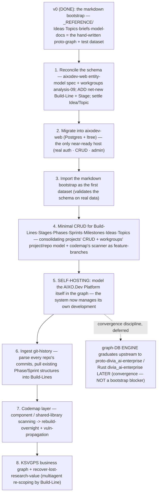

# Migration & Self-Hosting Proposal — from the scattered `_projects/` mess to the two-graph model

> Proposal (2026-06-22), John + Claude. How to get from **29 scattered projects** (`_projects/README.md`) to the new model: a **KSVGPS business graph** + an **AIXO.Dev engineering graph** that eventually **host themselves**. Grounded in a fresh review of `aixodev-web` / `aixodev-projects` / `aixodev-workgroups` + the full project inventory. Builds on [`STRATEGIC-LANDSCAPE-MODEL.md`](STRATEGIC-LANDSCAPE-MODEL.md), [`PROJECT-ORGANIZATION-MODEL.md`](PROJECT-ORGANIZATION-MODEL.md), [`CODEMAP-AND-SHARED-FRAMEWORK-MODEL.md`](CODEMAP-AND-SHARED-FRAMEWORK-MODEL.md). **This is a proposal — it surfaces the forks; it doesn't pre-decide them.**

## 0. Two headline findings that change the framing

1. **The target schema is ~80% already designed — and never migrated.** `aixodev-web`'s `_specs_and_plans/phase_05.../reference--entity_model_specification.md` (66 KB) already specifies SQL for `phases`, `sprints`, `dev_tasks` (ltree), `topics`, `research_projects`, `agents`, `software_projects`, `backlogs` (Families 2–9), and `aixodev-workgroups`' 2026-06-18 research designed the strongest `project`/`repository`/`project_repository` + cross-repo rule-sync schema (`analysis-09`/`-12`), consciously written as a *successor* to the live models. **Neither was built.** So step one is *reconcile two existing designs + migrate*, not *design from scratch*. **Caveat:** **"Build Line" and "Stage" are net-new even to those specs** (the spec's spine is Goal→Initiative→Phase→Sprint; our model inserts Build-Line and Stage above Phase) — those two entities are the genuine new design work.
2. **None of your scattered repos is a personal-convenience spike.** The inventory triage finds **0 confident DailySpikeDriver donors** — every one of `aixodev-projects/-codemap/-collabs/-workgroups` is a *core-functionality prototype* meant to merge into `aixodev-web`. So your "create a quick separate Python/Flask project" habit was really the **prototype→product** pattern, and the new model converts those into **feature-branches/Build-Lines of the parent**, not separate repos. The **DailySpikeDriver is forward-looking** — a place for *future* personal hacks you don't currently have as repos. (Which is the cleanest possible confirmation of your own instinct: *codemap isn't a DailySpikeDriver thing; it's a feature-branch in AIXO.Dev's middle Build-Line.*)

## 0b. The confirmed plan & versioning (John, 2026-06-22)

The engine fork (§3.2) is **decided**, giving a clean three-version path — **v0.1 and v0.5 are both temporary scaffolds to reach the real v1:**

- **v0.1 — the markdown bootstrap** (`_REFERENCE/` Ideas/Topics/briefs/model-docs): the hand-written proto-graph + dataset; **what we rely on until v1**, especially for KSVGPS.
- **v0.5 — `aixodev-web` on *relational* PostgreSQL + LTREE** (confirmed: plain relational SQL, *not* a graph-in-Postgres like Apache AGE — that's a v1-spike candidate). The **immediate** build: CRUD for the new-model types (Build-Lines · Build-Envelopes · techstacks · Stages · Phases · Sprints · Milestones · Ideas · Topics · Project/Repository), so the whole scattered `_projects` inventory becomes **visible and reorganizable in the AIXO.Dev Platform UI**. Its purpose is *convenience* — to gather and organize the portfolio far better than today — not to be the final platform.
- **v1 — the real graph-DB** — validated by the **KSVGPS graph-DB spikes**, then **graduated back** into a future AIXO.Dev Build-Line. **KSVGPS skips Postgres and goes straight to v1**; v0.5 AIXO.Dev exists to organize the work while that happens, and the **`proto-divia_ai-enterprise ⟷ kingstrat-adventuregps` chain is preserved.**

## 0c. Revised execution (2026-06-22): a *new* `aixodev-GEN2`, freeze everything else

Refinement after the subproject catalog: **we do not rename or edit the current `aixodev-web`.** Every existing repo becomes a **frozen "scavenge-source"** (almost all of them change under the new model anyway, so an in-place rename was never the right tool). Instead we **create one new project, `aixodev-GEN2`**, whose *first* functionality is the new model itself — a web CRUD UI for Project · Repository · ProjectRepository · techstack · Build-Line · Build-Envelope · Stage · Milestone · Phase · Sprint · Idea · Topic — and the **Build-Lines get defined *in that UI*** (the BL-A…BL-E table below stays as our thinking, not hard-wired config). **Lift-and-shift = read a source repo's implementation and *re-implement* it in GEN2 (never `git pull`), verifying GEN2 works with its small subset; only GEN2 is ever edited.** So **wherever this doc says "build into / host in `aixodev-web`," read "build `aixodev-GEN2`, lifting from `aixodev-projects` (base) / `-workgroups` (schema) / `aixodev-web` (later, auth) as frozen sources."** The how-to is [`AIXODEV-GEN2-BUILD-PLAN.md`](AIXODEV-GEN2-BUILD-PLAN.md).

## 1. Where each project goes (triage)

Most projects **stay standalone ventures (A)** and simply get *modeled* in the graph (their Build-Lines/Stages become data) without moving. The ones that **change**:

| Project | → | Action |
|---|---|---|
| **`aixodev-web`** | **the host** | Becomes the AIXO.Dev Platform's primary Build-Line and the self-hosting target. Everything below merges *into* it. |
| `aixodev-projects` | **fold → `aixodev-web`** | Its project/repo/language CRUD + the design-theme system merge up as feature-branches; repo retires once merged. |
| `aixodev-codemap` | **fold → `aixodev-web`** | The structural scanner becomes the codemap feature-branch in `aixodev-web`'s middle Build-Line (per [`CODEMAP-AND-SHARED-FRAMEWORK-MODEL.md`](CODEMAP-AND-SHARED-FRAMEWORK-MODEL.md)); the far-future Rust/RosettaMQ scope stays parked. |
| `aixodev-workgroups` | **fold → `aixodev-web`** | **No code to move** — but its `analysis-09` project/repo schema + `analysis-12` cross-repo rule-sync **design** are the most important inputs to the schema reconciliation (§3.1). |
| `aixodev-collabs` | **fold → `aixodev-web`** (flag) | Code folds up; but it's *also* the `_workflows/` lineage root — keep that provenance separate from the code merge. |
| `aixodev-openhands` | **fold findings, then archive** | A research/docs corpus, not a code prototype — mine its findings into the knowledge base, retire the repo. |
| `proto-divia_ai-enterprise` | **graph-DB engine candidate (flag §5)** | Its convergence into Rust `divia_ai-enterprise` is a *language-rewrite*, not a code-merge; **and `kingstrat-adventuregps` forks from it** — can't be collapsed blindly. It's central to the engine question. |
| `kingstratvc-web` | **archive** | Superseded by `kingstrat-adventuregps`. |
| `divialife-android` / `-iOS`, `diviacontacts-iOS` | **park** | Deliberate future parking-areas (distinct from "archive" — forward-parked, not historical). |
| `divia_cards` | **flag (E)** | Standalone library or a component of the Divia.AI family? No stated merge target — a John call. |

**The conceptual rule going forward:** *same-techstack* core-functionality experiments = **feature-branches of the parent Build-Line** (no new repo); *different-techstack succession* (Python→Rust) = a **separate succession Build-Line** (which may justify its own repo); *personal-convenience hacks* = the **DailySpikeDriver Build-Line** (`research=OFF`). The separate-spike-repo was a workaround for not having Build-Lines + the research-firewall.

## 1b. The AIXO.Dev rebuild — its own Build-Lines (from the history catalog)

The full feature/research catalog of `aixodev-web` is in [`AIXODEV-WEB-HISTORY-CATALOG.md`](AIXODEV-WEB-HISTORY-CATALOG.md) (Phases 1–4 complete + Phase 5 in progress; ~660–695 tests; 24 research tracks). Treating the current repo as a **"bag of assets to scavenge,"** its features/research sort into **five Build-Lines** (no DailySpikeDriver — doesn't apply to this project):

| Build-Line | What it holds (catalog bucket) | Horizon | Status |
|---|---|---|---|
| **BL-A · Platform Product** | The shipped app + near-term roadmap — auth/RBAC, issue tracking (SocketIO), session import (lossless JSONB), versioned wiki, analytics, GitHub integration, hook-sync, the aixocode↔web ingest API (Bucket 1: *all the shipped code* — Phases 1–4 + P5 S02–04). | now / 3–6mo | **built** |
| **BL-B · PostgresModeledGraph (v0.5 — IMMEDIATE PRIORITY)** | The new-model project-management layer in relational Postgres + LTREE: CRUD for Build-Lines · Build-Envelopes · techstacks · Stages · Phases · Sprints · Milestones · Ideas · Topics · Project/Repository — the whole `_projects` portfolio, visible + reorganizable in the UI. Reconciles the two competing entity specs + `workgroups/analysis-09` (Bucket 2: mostly *spec, not built*). | now (build first) | **to build** |
| **BL-C · FullGraphDatabase (v1)** | The graph-DB-engine version — the graph tech validated in the **KSVGPS spikes**, graduated back here (Bucket 3: KG-tech-landscape research only today). | future | research-only |
| **BL-D · ExoDev.Pro Engagement Platform** | Consulting-engagement tooling — the **EngagementGraph**, FDSE/Palantir-style features, the national-consulting research (Bucket 4: lives in `_research/product_development_strategy/` Tracks 18/21/22/23 + the carved-out `internal_engagement_graph/`; dated Apr-2026, cleanly separable). | 12–18mo | research-only |
| **BL-E · Far-Future Enterprise** | The 2028–2030 "shock-and-awe" vision + national-LLC expansion (Bucket 5: Track 24). A **Triangulation-Target band** — a destination the multiagent workflow can dump far-future ideas into, re-scoped by horizon. | 36mo+ | research-only |

**The rebuild move (once v0.5 exists):** walk the catalog and **pull/move/clone** each feature into BL-A/BL-B, and **scavenge the research** into BL-C/D/E as Triangulation-Target research — much of it **re-scoped by the multiagent workflow** (§6), curing the mixed-time-horizon mess. The current `aixodev-web` repo thus becomes *a clean collection of new-model Build-Lines* — and, being the authoritative organizer, the first project fully expressed in the model it enforces.

**Two catalog hazards to handle in BL-B:** (1) reconcile the **two competing entity-model specs** (the Phase-5 engineering `reference--entity_model_specification.md` vs. the product-strategy `03-entity-model-spec-v2.md`); (2) the **old 66KB entity-model spec is moved to a backlog as a *mining source***, not a build target — its still-valuable ideas (a research-container node, an OKR/key-results measurement spine, a first-class **Agent** entity, **custom-fields** as the no-migration evolvability hatch, + 6 more) are preserved in **[`LATER-007`](../_backlog_TODOs/LATER-007-aixodev-web-entity-model-spec-mining.md)** so nothing is lost.

## 2. The self-hosting bootstrap (the compiler analogy)

The apparent chicken-and-egg — *"we need the graph to manage projects, but the graph is itself a project"* — is broken exactly the way a compiler bootstraps: **the markdown `_REFERENCE/` layer is the hand-written "v0"** (written without the tool), and `aixodev-web` becomes the system that **compiles itself** once minimally functional.

**The minimum to reach self-hosting (Step 5) is small:** reconcile the schema (the hard part is just the 2 net-new entities), migrate it into `aixodev-web` (which already has the auth/CRUD/admin/ltree-capable Postgres infrastructure), import the markdown, hand-build CRUD for ~10–15 entities (boilerplate, since `aixodev-web` has **no auto-scaffold**), then enter the AIXO.Dev Platform itself as the first fully-modeled project. Everything after Step 5 is leverage, not prerequisite.

## 3. The two hard design problems (do these first)

### 3.1 Reconcile the two Project/Repo designs + insert Build-Line & Stage
There are **two** designs: the *live* one in `aixodev-web` (`projects` self-FK tree + `project_repositories`) and the *improved successor* in `aixodev-workgroups/analysis-09` (adds `local_path`, a proper M2M association object with `role`/`is_primary`, written by reading both siblings). Pick the workgroups design as the base (it's the conscious successor), then **insert the net-new layers**: `Build-Line` (owned by an Idea; carries Build-Envelope + the `research`-scope flag) and `Stage` (engineering span; drives toward `Milestone`). Decide how Build-Line/Stage sit relative to the spec's existing `software_projects`/Phase/Sprint spine. *This is the single highest-leverage design task.*

### 3.2 The graph-DB **engine** question — DECIDED (2026-06-22)
Does the engineering graph live in **`aixodev-web`'s own Postgres** (the entity-model spec's relational + ltree approach) **or** in the **`proto-divia_ai-enterprise` graph-DB server** (the convergence vision, where the ONE graph-DB engine concentrates and downstream projects are clients)? `aixodev-projects`' 2026-06-16 LATER item already flags routing this to proto-divia. **Decided (2026-06-22):** v0.5 AIXO.Dev uses **relational Postgres + LTREE** (plain relational, *not* graph-in-Postgres); the real graph-DB is validated in the **KSVGPS spikes** and **graduates back** into AIXO.Dev v1 later (the standard "build-now, graduate-infrastructure-upstream, watch-the-diff-shrink" discipline). **KSVGPS itself skips Postgres and goes straight to the graph-DB**, and the **`proto-divia_ai-enterprise ⟷ kingstrat-adventuregps` chain is preserved.** This keeps the bootstrap fast and acyclic. (The irreversible fork is the clean **client/engine seam** — hook that now so v0.5's project-management state can later point at the graph engine instead of holding it.)

## 4. Sequencing — AIXO.Dev-first vs. KSVGPS-first

| | **AIXO.Dev-first** (recommended) | **KSVGPS-first** |
|---|---|---|
| **The immediate activity is…** | building software → you need the *engineering* graph to manage the build (incl. building the graph itself = max dogfooding, fastest self-hosting) | strategy/ideation → the business graph is the crown-jewel value |
| **Readiness** | `aixodev-web` is a real app with auth/CRUD/admin + the 80%-designed schema | `kingstrat-adventuregps` is Phase-00-pending (no app yet) |
| **The dataset** | engineering Build-Line/Stage data is net-new | the markdown bootstrap is *mostly* business-side (Ideas/Topics) — a ready import set |
| **Cross-dependency** | AIXO.Dev-first **gives KSVGPS its engineering scaffolding** (KSVGPS-the-app's own Build-Lines/Stages live in the AIXO.Dev graph) — *your point* | "decide WHAT before HOW" — business drives engineering |
| **Self-hosting** | naturally engineering-first (the platform hosting its own build) | business graph doesn't self-host in the compiler sense |

**Decided (2026-06-22): a thin AIXO.Dev v0.5 organizing layer first → then the KSVGPS graph-DB is the real priority.** Build v0.5 (relational Postgres) *just far enough* to gather and reorganize the whole `_projects` portfolio in the AIXO.Dev UI — its job is **convenience/organization**, not to be the platform. Then **pause/slow** AIXO.Dev and **prioritize the KSVGPS graph-DB spikes + the real `kingstrat-adventuregps` build** (the higher engineering + business priority). **KSVGPS stays on the v0.1 markdown** until its graph-DB is up (no Postgres detour). The validated graph tech later **graduates back** into AIXO.Dev v1. So it is *not* "AIXO.Dev fully first" — it is "**a thin AIXO.Dev organizing layer first, KSVGPS graph-DB core next, AIXO.Dev v1 graph last.**"

## 5. Dependency & circularity check (looking for inconsistencies)

- **"Graph needed to manage the project that builds the graph"** → broken by the markdown v0 (Step 0) + the compiler bootstrap (Step 5). ✅ No true cycle.
- **KSVGPS-needs-AIXO.Dev (engineering view) ⟷ AIXO.Dev-needs-KSVGPS (Ideas/Ventures)** → broken by the markdown providing *both* initially; AIXO.Dev-first builds the engineering scaffolding while business data imports in parallel. ✅
- **`proto-divia_ai-enterprise` ⟷ `kingstrat-adventuregps`** → `kingstrat` forks from `proto-divia`; if KSVGPS-the-app is built on that fork *and* proto-divia is also the graph-DB-engine candidate, don't collapse proto-divia blindly — rehome the client fork first. ⚠️ Real dependency; §3.2 keeps the bootstrap off the proto-divia critical path (use `aixodev-web` Postgres), which **dissolves this from a blocker into a later convergence task.**
- **The engine fork (§3.2) is the one genuine inconsistency risk:** if you decide the graph *must* live in the Rust Divia.AI Enterprise server *before* self-hosting, the sequence inverts (build the Rust engine first) and everything slows. The recommendation (Postgres-now, graduate-later) is what keeps the plan acyclic and fast.

## 6. Recovering "lost" value from the old research

The codemap 168K-word corpus and the FracRealHomes 73-track Codex corpus aren't waste — they're **mis-scoped**, not wrong. Once Build-Lines/Build-Envelopes/Triangulation-Targets are modeled, a **multiagent research workflow** can ingest each old finding, **classify it by time-horizon → Build-Line** (near-term Seed vs. far-future Enterprise), and **refactor it into Build-Line-matched versions** (one for the EstimatePacket/Seed envelope, one for the National-AVM/Enterprise envelope). That directly cures the original frustration — *"Codex insisted on the National-AVM when I wanted email parsing"* — by re-filing the National-AVM research where it belongs and surfacing only the Seed-scoped findings for the near-term Build-Line. (A strong candidate for an early multiagent-workflow run, alongside the prediction-market/regulatory topic.)

## 7. Open forks for John (in priority order)

1. ~~The engine fork (§3.2)~~ — **DECIDED**: relational Postgres for v0.5; the graph engine is validated in KSVGPS and graduates back for v1.
2. ~~AIXO.Dev-first?~~ — **DECIDED** (§4): a thin AIXO.Dev v0.5 organizing layer first, then the KSVGPS graph-DB core, then AIXO.Dev v1.
3. **Build-Line + Stage as net-new entities** — how they sit relative to the existing `software_projects`/Goal→Initiative→Phase→Sprint spine (§3.1).
4. **`divia_cards`** — standalone library or Divia.AI-family component? (Triage bucket E.)
5. **Reconcile the two Project/Repo designs** — adopt the workgroups `analysis-09` successor as the base? (My rec: yes.)
6. Whether to **resurrect `aixodev-codemap` as a focused feature-branch** now or after Step 4.

## 8. Cross-references

- Model: [`STRATEGIC-LANDSCAPE-MODEL.md`](STRATEGIC-LANDSCAPE-MODEL.md) · [`PROJECT-ORGANIZATION-MODEL.md`](PROJECT-ORGANIZATION-MODEL.md) · [`CODEMAP-AND-SHARED-FRAMEWORK-MODEL.md`](CODEMAP-AND-SHARED-FRAMEWORK-MODEL.md).
- Convergence discipline (graduate infrastructure upstream): [`ARCHITECTURE_CONVERGENCE.md`](ARCHITECTURE_CONVERGENCE.md) · cross-repo rule-sync precedent: `aixodev-workgroups/_specs_and_plans/_research/workgroups_foundations/analysis-12--rulegroup-and-cross-repo-sync.md`.
- Research-recovery + workflows: [`../_workflows/README.md`](../_workflows/README.md) · [`../_backlog_TODOs/RESEARCH-BACKLOG.md`](../_backlog_TODOs/RESEARCH-BACKLOG.md).
