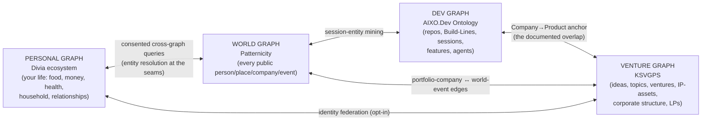

# 00 — Portfolio Thesis (Rethought)

> **RETHINKING-Fable edition** — a full-replacement, upgraded synthesis of the whole portfolio, written by Claude Fable 5 (2026-07-01) from the complete `ULTIMATE_VISION/**` corpus held in one context. This is the through-line document: every other file in `RETHINKING-Fable/` instantiates what this one states. Written for future-Fable as primary reader, en route to the real KSVGPS graph-DB.

## 1. The portfolio in one paragraph

One person's thirty-year design — a proactive personal/organizational intelligence — decomposed into independent, separately-owned ventures that share **a philosophy** (discover-and-suggest from implicit real-world data; never interrogate the user), **a protocol** (Divia.Network / DiviaCards, an open http-like standard any company can adopt), **an epistemic discipline** (confidence, provenance, and staged trust everywhere), and **a compounding substrate** (graphs of resolved entities and lossless captured history). The ventures are deliberately *not* a suite: they are standalone companies with overlapping KingStrat-LP ownership that happen to speak the same open protocol. The portfolio's moat is not any single app — it is the accumulated, losslessly-preserved, entity-resolved data plus the reusable machinery for turning captures into staged, trustworthy action.

## 2. The Universal Loop — the one pattern every venture instantiates

Read across all ~24 repos at once, the portfolio is a single seven-stage loop, instantiated per domain:

1. **Capture losslessly** — natural language, ambient voice, receipts, photos, feeds, session logs; verbatim, byte-for-byte, no forms.
2. **Unify first** — scan-and-import scattered legacy fragments into one deduplicated record before any inference ("first unify, then understand").
3. **Resolve entities** — map raw mentions to durable nodes (merchant, food, person, parcel, contractor, repo, world-figure) in a graph.
4. **Infer with humility** — derive interpretations carrying `confirmed / inferred / estimated` status, a confidence band, and a provenance trail; estimate rather than abstain; widen the range rather than fake the number.
5. **Run recurring agent cycles** — scheduled review/improve/suggest passes at a *domain-appropriate cadence* (nightly for replenishment, weekly for GTD and ledgers, continuous for regulation and news).
6. **Stage across the trust boundary** — the agent is the clerk, the human is the executive; proposals are staged, never auto-committed, with autonomy graduating per-task on an explicit ladder (L0 reporter → L1 proposer → L2 gated executor → L3 autonomous-with-audit).
7. **Learn from corrections** — every human confirm/correct/reject is first-class data that sharpens this user's priors; the loop's accuracy compounds.

| Venture / product | Domain the loop points at | Capture surface | Unified record | Recurring cycle |
|---|---|---|---|---|
| aixocode / AIXO.Dev Platform | software development itself | CLI-session wrap, hooks | lossless `*_sessions.db` archives + the dev Ontology | dev-stewardship sweeps, review workflows |
| DiviaHome | the household | Activity Log, kitchen device | the unified household record | nightly replenishment review |
| Divia.Life | one person's life | Journal, Agenda, quick capture | the personal PKMS | GTD weekly review (agent-prepared) |
| DiviaContacts | professional relationships | Gmail (thin renderer) | the org task/relationship graph | relationship-cadence review |
| LegendaryMoney | money | NL money inbox, receipts, feeds | the confidence-aware ledger | ledger anomaly/drift review |
| Sattvasic Health | the body | device imports, food log, labs | the longitudinal health record | weekly correlation pass |
| TastyPantry / spicemaster | the kitchen and palate | food logs, receipts, cabinets | inventory + taste fingerprint | depletion → replenishment |
| Patternicity | the public world | news ingestion, NER at scale | the world-knowledge entity graph | continuous; Morning Briefing fan-in |
| KSVGPS | the venture portfolio itself | briefs, brain-dumps, filings | the two-layer strategic landscape | nightly "dreaming" + Monday partners' brief |
| CrowdMadness | collective foresight + regulation | market trades, statute feeds | market/question graph + regulatory diffs | nightly regulatory radar |
| FracRealHomes | real property | parcel data, 3D capture | the EstimatePacket evidence graph | permit/filing watch per parcel |
| ReDreamRebuild | renovation decisions | content + OSHA records | contractor safety report-cards | violation-data refresh |

**Design consequence:** the loop's machinery — capture cards, import adapters, entity resolution, the epistemic envelope, the recurring-agent runtime, the staging/approval surface, the correction store — should be built **once each** and consumed everywhere. That machinery is enumerated as fourteen shared primitives in [`02-SHARED-PRIMITIVES-AND-SYNERGY-MATRIX.md`](02-SHARED-PRIMITIVES-AND-SYNERGY-MATRIX.md).

## 3. The Four Graphs — the portfolio's actual shape

The portfolio converges on **four sovereign knowledge graphs**, one per world, all sharing one schema philosophy (typed nodes, epistemic edges, bitemporality) and one convergence engine (the Divia.AI Enterprise graph-DB core, consumed as clients-not-copies):

- **Personal graph** (Divia): privately owned, local-first, on servers the user controls. The "personal Palantir" — your life's data unified into one legible graph *you* own.
- **World graph** (Patternicity): the public world entity-resolved at scale; the external-context sensor every other graph queries ("the memory layer"). The entity-graph *is* the product.
- **Venture graph** (KSVGPS): the two-layer Strategic Landscape (Layer-A Ideas/Topics + Layer-B Ventures) plus corporate structure, IP-assets, LP relationships. The firm's operating system and this corpus's destination.
- **Dev graph** (AIXO.Dev): every repo, Build-Line, session, feature, and agent contribution — the engineering peer of KSVGPS, overlapping it only at `Company → Product`.

**The upgraded claim:** the four graphs are not four products that happen to use graphs — they are one epistemology applied to four worlds, and the highest-value capabilities in the portfolio are the ones that *bridge* them (a world event touching your portfolio company; a merchant recall touching your ledger; a session transcript revealing a shared-library candidate; a news-driven regulatory diff re-scoping a venture's roadmap). Bridges cross ownership and privacy boundaries, so **every bridge is a consent surface** — cross-graph queries are explicit, per-query or per-standing-grant, never silent. That constraint is an asset: it is the architecture the 2026–2029 privacy/regulatory environment rewards (see [`01-TECHNOLOGY-HORIZON-2026-2029.md`](01-TECHNOLOGY-HORIZON-2026-2029.md) §6).

## 4. One fact, many interpretations — the corrected fan-out model

The canonical demo ("I had El Pollo Loco for dinner" → pantry + macros + expense + log) has always been narrated as a *dispatch*: an agent parses a capture and sends copies to apps. Modeled that way, corrections fracture (fix the amount in the ledger, the pantry copy is stale), provenance duplicates, and confidence has nowhere to live.

**The upgraded model: one Fact node, many typed Interpretation edges.**

- The capture is a **Fact** (a verbatim, immutable observation — the Activity-Log DiviaCard, with source, time, place, speaker).
- Each domain reading is an **Interpretation edge** from that Fact to a domain record: `interpreted-as → FoodEvent(quesadillas ×2)`, `interpreted-as → NutritionIntake(~1,050 kcal)`, `interpreted-as → Transaction($11.80 est., band ±$4)`, `interpreted-as → PlaceVisit(El Pollo Loco #3412)`.
- Every Interpretation edge carries the **epistemic envelope** (assertion type, confidence, provenance, asserting agent, timestamps — the full spec is [`04-GRAPH-SCHEMA-AND-EDGE-CATALOG.md`](04-GRAPH-SCHEMA-AND-EDGE-CATALOG.md) §2).
- Apps **subscribe to interpretation types** over the protocol rather than receiving copies; a correction to the Fact or to one interpretation propagates because there is one source of truth. (Offline/local-first reality means CRDT-replicated projections — DiviaMesh's job — but *semantically* there is one fact.)

This is the precise meaning of the "7-dimensional fact": a single dinner sentence is simultaneously a food event, a nutrition event, a financial event, a location event, a taste-preference signal, an inventory decrement, and a temporal/social context marker — **one node, seven-plus edges**, not seven copies. The Divia.Network v0 contract should be specified as *fact-publication + interpretation-subscription*, and this is a `[DEALBREAKER-HOOK]`: retrofitting single-fact semantics onto a copy-dispatch protocol is a rewrite.

## 5. The trust architecture — the portfolio's most defensible position

Every venture repeats the same stance, which should be canonized once and marketed everywhere:

- **The clerk/executive boundary.** Agents prepare, humans decide. Nothing is completed, deleted, sent, ordered, or committed autonomously until a specific task-type has been explicitly graduated up the autonomy ladder — and even L3 runs with an after-the-fact audit line.
- **Visible epistemics.** Estimated-vs-confirmed is a first-class *visual language*, not metadata — the thing screenshots sell. False precision is treated as more dangerous than admitted uncertainty (the Cal-AI lesson, the FracRealHomes "widen the range, don't move the number" rule, LegendaryMoney's confidence bands: one principle, three domains).
- **Data sovereignty.** Local-first clients, self-hostable servers, `.dvai` files the app can explain, a planned open mirror format, and the Divia.Foundation Code Vault (guaranteed future source release) — a coherent "you'll never be orphaned, and your intimate data never leaves infrastructure you control" promise.
- **Statistical honesty at the insight layer.** Cross-domain correlation mining at this breadth *will* generate false positives; insights ship as hypotheses with effect sizes and multiple-comparison discipline, framed for the user (and, in health, their clinician) to evaluate — never as diagnoses or directives.

**Why this is strategy, not ethics garnish:** the 2026–2029 environment (agentic-AI incidents, AI-act enforcement, data-broker backlash) is turning trust architecture into the *purchasing criterion* for exactly the customers these products want — SME IT buyers, regulated enterprises, privacy-motivated consumers. The portfolio's trust stance is its hardest-to-copy differentiator because it is structural (local-first, staged autonomy, open escrow) rather than promissory.

## 6. The economics-inversion thesis, generalized

Three ventures independently discovered the same "why now": work that once required teams of specialists is now a recurring LLM agent — nightly per-state regulatory tracking (CrowdMadness), NER-at-scale entity resolution (Patternicity), continuous portfolio dossier maintenance (KSVGPS). Generalized:

> **The feasibility frontier is moving faster than human planning cycles. A venture portfolio that *models itself in a graph* can re-evaluate every shelved idea against the moving frontier automatically; one that doesn't will systematically miss its own reboots.**

MobThought is the proof-by-counterexample: the 2018 PASPA repeal moved the frontier, and no system existed to flag that a shelved 2008 idea had become feasible — the reboot waited until 2026. The KSVGPS nightly "dreaming" agent re-evaluating dated Triangulation Targets against tracked external events is the productized version of never missing that moment again. This makes KSVGPS not a record-keeping intranet but a **feasibility radar** — the single sharpest justification for building the graph-DB now, and the reason external Events/Trends must be first-class nodes from day one.

## 7. Business-model patterns (the recurring plays, stated once)

- **Prototype open, harden commercial:** AGPL+Commercial (CLA) Python labs → proprietary Rust products → recurring-revenue SaaS layers. (Divia: DiviaHome → Enterprise → Global.)
- **Consulting pull-through:** forward-deployed engineers fund and validate the platform; graduation-rate is the honesty metric; ring-fence platform from services revenue. (ExoDev/AIXO.)
- **Dogfood-as-first-customer:** KSVGPS de-risks Enterprise; ExoDev.Pro consultancies de-risk the AIXO Platform; John's household de-risks DiviaHome. Every venture's first install is inside the portfolio.
- **Content/audience on top, data moat beneath:** ReDreamRebuild (SEO content over an OSHA violations dataset), spicemaster (consumer app over the pairing corpus), Patternicity (news surfaces over the world graph). The content earns trust and traffic; the structured data underneath is what competitors can't replicate.
- **The lowered profit-bar for ecosystem pieces:** where a piece is wanted for non-profit reasons (protocol seeding, agent memory, cross-promo), the build decision inverts to "is there a significant reason NOT to?" — break-even on hosting suffices. (Patternicity's four pieces; applies equally to TastyPantry and DiviaCards tooling.)
- **Compounding archives as moats:** byte-for-byte session archives (AIXO), the pairing corpus (spicemaster), the OSHA dataset (ReDreamRebuild), crowd-forecast history (CrowdMadness→CrowdResearch), the world graph (Patternicity). Data that accretes with use and cannot be retro-collected.
- **Venture-studio operating leverage:** the Series-LLC → Delaware-C blueprint, KSVGPS as outsourced legal/finance/IP department, the domain/IP-asset repository with assign-at-incorporation / reclaim-at-pause. The studio itself is a product pattern.

## 8. Rejected / Flawed (thesis-level call-outs)

- **⛔ "10,000× better, not 10%" as positioning.** Rhetorically memorable, epistemically indefensible, and it contradicts the portfolio's own honest-uncertainty discipline (FracRealHomes deliberately sells *completeness over accuracy*; LegendaryMoney sells confidence bands). An unfalsifiable multiplier invites exactly the AI-hype skepticism these trust-first products should be immune to. **Repair:** keep the proactive-vs-reactive *contrast* (it is real and demo-able), but quantify concrete deltas — capture-to-record friction in seconds, review-completion rates, replenishment misses prevented, WPAA-style human-approved agent actions. "Siri answers; Divia notices" is a stronger sentence than any number.
- **⛔ "Divia.AI Global as the portfolio-wide account spine" (sign-in-with-Divia everywhere).** As stated in the venture-level ideation, this contradicts the settled open-protocol doctrine: if every portfolio startup *requires* Divia identity, the "independent companies that happen to speak an open protocol" positioning collapses back into the 1990s-suite perception — and it concentrates a cross-domain identity honeypot that the privacy stance explicitly disclaims. **Repair:** specify identity federation as an *optional capability of the open standard* (any spec-conforming IdP works); Divia.AI Global competes as the best reference implementation, not the required spine. Portfolio startups *may* adopt it the way websites adopt "sign in with Google" — a choice per company, never a condition of protocol membership.
- **⛔ The "standalone vs. ecosystem" framing war (ERRATA E-06) treated as a contradiction to resolve editorially.** It is not a documentation bug; it is the protocol doctrine not yet having existed when those repos were written. **Repair:** re-describe every "standalone" product as *"an independent product that implements the Divia.Network protocol"* — standalone AND connected are simultaneously true once membership means speaking a protocol rather than joining a family. (spicemaster3000 remains genuinely unconnected today; wiring it in is a roadmap item, not a re-description.)
- **⛔ Treating the ERRATA log as a side document.** A contradiction ledger kept apart from the knowledge it corrects will drift exactly like the docs it audits. **Repair:** in the graph era, encode errata *natively* — single-source assertions become edges whose provenance lists one side (E-08's Swarm↔Enterprise edge carries `asserted_by: agentswarms-docs-only`); contested names become question-mark alternative edges (E-01, E-02); capability-ahead-of-reality becomes `status: documented-not-built` on the feature node. The ERRATA document then becomes a *query*, not a file. (Spec: [`04-GRAPH-SCHEMA-AND-EDGE-CATALOG.md`](04-GRAPH-SCHEMA-AND-EDGE-CATALOG.md) §2.4.)

## 9. Reading order for future-Fable

1. This file — the pattern language.
2. [`01-TECHNOLOGY-HORIZON-2026-2029.md`](01-TECHNOLOGY-HORIZON-2026-2029.md) — what the AI capability curve makes possible, per year, per venture.
3. [`02-SHARED-PRIMITIVES-AND-SYNERGY-MATRIX.md`](02-SHARED-PRIMITIVES-AND-SYNERGY-MATRIX.md) — the fourteen build-once primitives and the cross-venture synergy map.
4. [`03-IDEAS-LEDGER.md`](03-IDEAS-LEDGER.md) — the expanded Layer-A ideas ledger (Existing / Proposed / Rejected).
5. [`04-GRAPH-SCHEMA-AND-EDGE-CATALOG.md`](04-GRAPH-SCHEMA-AND-EDGE-CATALOG.md) — the KSVGPS import source: node types, edge types, and the full edge instance catalog.
6. [`VENTURES/`](VENTURES/) — eleven consolidated venture dossiers (products folded in).
7. [`05-USER-STORIES.md`](05-USER-STORIES.md) — the ecosystem in motion, including new compound scenarios.
