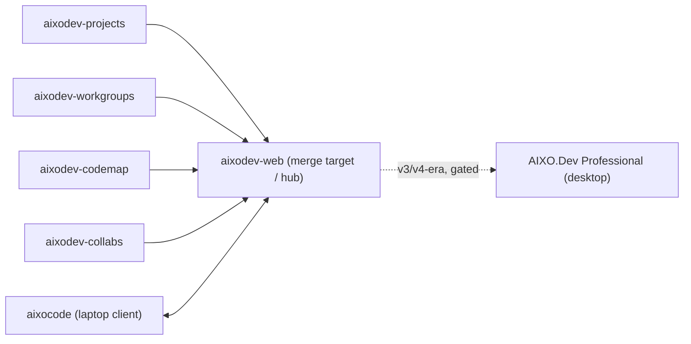
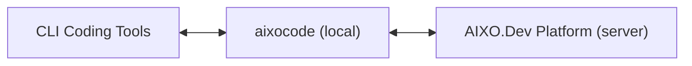

# Brief (Software-Dev) — `aixodev-platform`

> **Software-dev-side brief** → the **AIXO.Dev Platform *as* the software-dev knowledgebase** (repos · upstreams · Build Lines · Build Envelopes · Stages/Phases/Sprints · convergence · dev discussions). This platform is the **engineering peer to KSVGPS's business knowledgebase**: the place where every project / repo / Build Line / dev-team discussion is modeled in extreme detail. Paired **[business brief](../ULTIMATE_VISION/PRODUCTS/AIXO.Dev/aixodev-platform.md)** (the `Company → Product` overlap anchors both). Each `##`/`###` section is bounded so it maps cleanly to a graph-DB node/edge. **Platform-level brief** — an umbrella over multiple repos. *(Software-dev briefs live in `_REFERENCE/SOFTWARE_DEV/`, kept in MetaProject per the bootstrap decision.)*

## Project / repos (the platform = a family, not one repo)

This brief covers the **platform umbrella** and folds in the **core knowledgebase trio** (`aixodev-web` + the `aixodev-projects` / `aixodev-workgroups` prototypes). The other AIXO.Dev components — `aixocode`, `aixodev-codemap`, `aixodev-collabs`, `aixodev-openhands`, `aixodev-professional` — are noted here as platform Build Lines but get **their own briefs in a later batch.**

| Repo / dir | GitHub | Role in the platform | Techstack |
|---|---|---|---|
| **`aixodev-web`** | `@aixodev/aixodev-web` | **The central server/hub + merge target.** Projects, issues, AI-session transcripts, wiki, GitHub integration, analytics, session-ingest API. | Python 3.11 · Flask 3.1 · SQLAlchemy 2.0 · PostgreSQL 16 · SocketIO/eventlet/Redis · Jinja2/HTMX/Tailwind · JWT + GitHub OAuth · Dramatiq · Playwright |
| **`aixodev-projects`** | `@aixodev/aixodev-projects` | Prototype → now a **design-theme management system** (DB-as-source-of-truth for design tokens; DESIGN.md ⇄ W3C DTCG interchange). Merges into `aixodev-web`. | Flask · SQLAlchemy · SQLite · Bootstrap 5 CDN + Jinja2 (no SPA) |
| **`aixodev-workgroups`** | `@aixodev/aixodev-workgroups` | Prototype for **runtime agent task-coordination & assignment** (claim/lock/hand-off/dependency ordering). Merges into `aixodev-web`. | Flask system-of-record **+ FastAPI + Uvicorn status sidecar** (one shared SQLAlchemy schema) |
| **`aixodev-aixocode`** *(own brief later)* | `@aixodev/aixodev-aixocode` | The shipping **laptop-side TUI** — the local half of the client/server split. | Python 3.12+ · Prompt Toolkit · SQLite (WAL) · TOML · `uv` |
| **`aixodev-codemap`** *(own brief later)* | `@aixodev/aixodev-codemap` | Source-code analysis prototype (structural + semantic + cross-project). Folds into `aixodev-web`. | Flask · SQLAlchemy · SQLite |
| **`aixodev-collabs`** *(own brief later)* | `@aixodev/aixodev-collabs` | Design home for the next-gen cross-vendor collaboration bus (successor to third-party `ensemble`). | Planned Flask · SQLAlchemy · SQLite (event log) |
| **`aixodev-openhands`** *(own brief later)* | `@aixodev/aixodev-openhands` | Research/analysis workspace + an "Open Prompt Prototype." | React/FastAPI micro-apps; JSON storage |
| **`aixodev-professional`** *(own brief later)* | _(local repo; no GitHub remote yet)_ | Planned cross-platform desktop edition. **Name/stack contested** (see [E-02](../ERRATA.md)). | Planned Rust/Tauri v2 + SvelteKit (per its README) |

- **License (platform):** **Proprietary** — `aixodev-web` is `LicenseRef-Proprietary` ("© AIXO.Dev Platform LLC, An ExoDev.AI Company. All Rights Reserved"); `aixodev-projects` / `aixodev-codemap` / `aixodev-professional` likewise Proprietary; `aixodev-collabs` / `aixodev-workgroups` / `aixodev-openhands` undocumented. **Exception:** `aixocode` is **MIT** (the open-core top-of-funnel; the only MIT product among proprietary AIXO.Dev siblings).
- **Maps to business Product:** AIXO.Dev Platform (the [business brief](../ULTIMATE_VISION/PRODUCTS/AIXO.Dev/aixodev-platform.md)).

## Build Lines · Build Envelopes · Triangulation Target

| Build Line | Build Envelope | Role / status |
|---|---|---|
| **`aixodev-web` (platform server)** | "Seed/Platform" (Python · Flask · PostgreSQL · small product team) | The central hub and **merge target**; Phases 1–4 complete, Phase 5 (entity-model/Ontology) active. Delivers the platform's web surface. |
| **`aixodev-projects` (theme prototype)** | "Prototype Freedom" (Flask · SQLite · solo) | Most mature prototype; the **design layer** that merges up into `aixodev-web` (the one surviving cross-project constraint = PostgreSQL portability). |
| **`aixodev-workgroups` (task-coordination prototype)** | "Prototype Freedom" (Flask + FastAPI sidecar · SQLite) | The **task-definition/assignment "brain"**; Phase 00 pending. Merges into `aixodev-web` (sidecar may become an async route group / separate service / background worker on re-merge). |
| **`aixocode` (laptop TUI)** | "Power-user laptop tool" (Python 3.12+ · Prompt Toolkit · SQLite WAL) | The shipping **local half** of the client/server split; captures sessions losslessly, syncs to the server. *(Own brief later.)* |
| *(other prototypes)* `codemap` · `collabs` · `openhands` | "Prototype Freedom" | Research/prototype Build Lines that converge into `aixodev-web`. *(Own briefs later.)* |
| *(far-future)* **AIXO.Dev Professional** | "Desktop" (planned Rust/Tauri v2 + SvelteKit) | Succession-style desktop edition; long-horizon (v3/v4 era), gated. **Name/stack contested** (see [E-02](../ERRATA.md)). |

- **Triangulation Target:** a mature platform where AI agents are **persistent, named, tracked team members** working alongside humans across hundreds of projects over years — with the team's entire software-development reality modeled as **one queryable "Ontology" knowledge graph** the team owns (DomainGraph + ClientDomainGraph + EngagementGraph). The prototypes converge into `aixodev-web`; the byte-for-byte lossless session archive is the connective tissue.

## Stages → Phases → Sprints

- **`aixodev-web`:** Phases 1–4 complete; **Phase 5 (entity model & platform vision) active.** ~695 tests, 25-table schema, 19 API blueprints. *Most recent activity is product/venture strategy research (the Apr-2026 Phase-D suite), not app code.*
- **`aixodev-projects`:** Phase 01 complete; **Phase 02 (Theme Management) complete** (13 sprints, 912 tests, ruff clean). Phase 03 undefined.
- **`aixodev-workgroups`:** **Phase 00 pending** (not started; zero code). The single-process-async-vs-two-process question is the central Phase-00 design bet.
- **`aixocode`:** Phases 0–7 complete; **Phase 8 (Analytics, Knowledge & Ecosystem Expansion) in progress** (~4 of 7 sprints; ~45 sprints, ~651 commits, ~1,700 tests). *(Own brief later.)*

## The platform AS the software-dev knowledgebase (Batch-1 distinctive role)

This is the platform's defining role for Batch 1: **`aixodev-web` + the `aixodev-projects` / `aixodev-workgroups` prototypes model the software-dev side of the portfolio in extreme detail** — the engineering peer to KSVGPS's business knowledgebase. Per [`../PROJECT-ORGANIZATION-MODEL.md`](../PROJECT-ORGANIZATION-MODEL.md), the AIXO.Dev model owns: every project · repo · repo-remote/upstream · **Build Line · Build Envelope · Stage → Phase → Sprint** · techstack · lineage/convergence relations · **dev-team discussions** — whereas the business side (companies / Brands / Products / GTM / domains) lives in KSVGPS. The two knowledgebases **share an overlap anchored at `Company → Product`** and are otherwise kept clean of each other.

- **`aixodev-projects`** prototypes the *project/repo* modeling (Project / ProjectLanguage / ProjectRepository, parent-child hierarchy, auto-slugs) — plus the design-token layer.
- **`aixodev-workgroups`** prototypes the *runtime task-coordination* layer — where "recurring autonomous-agent tasks live and get assigned" (the brain in the brain/body/face split); pairs with `aixodev-collabs` (the messaging/decision substrate).
- **`aixodev-web`** is where these merge and where the **dev-team discussions** + AI-session transcripts are modeled and analyzed (lossless transcript viewer; session-ingest API).

## Convergence chain & discipline

- **Convergence is the discipline:** the Flask prototypes (`aixodev-projects`, `aixodev-workgroups`, `aixodev-codemap`, `aixodev-collabs`) each prove a slice, then **merge proven pieces up into `aixodev-web`** (the hub). The "Prototype Freedom" stance lets them move fast; the one surviving cross-project constraint is **PostgreSQL portability** for the eventual merge.
- ⚠️ **Caveat:** the "merge target" framing is asserted in the index and the prototypes' docs but is **not corroborated inside `aixodev-web`'s own docs** — see [`../ERRATA.md` E-09 / E-02](../ERRATA.md).
- **The client/server split:** `aixocode` (laptop) ↔ `aixodev-web` (server). `aixocode`'s synchronous **CollabPair** (2 agents + human, fresh/temporary) is the laptop pattern; the Platform's asynchronous **"dozens-of-agents, Asana-model"** coordination (persistent agents, task queues) is the server pattern. The Platform owns persistent agent personalities (each with a self-editable `SOUL.md`, each backed by a specific model engine); aixocode's planned **AgentEngine** mode executes them locally.
- **`_workflows/` lineage:** `aixodev-web`'s `_workflows/` system is the **upstream template that seeded the Divia family** (the bootstrap workflow uses "Divia AI Desktop Pro" as its worked example). ⚠️ The bootstrap-lineage "root" is mis-reported across repos — git history says the chain is `aixodev-codemap → aixodev-projects → aixodev-collabs → aixodev-workgroups`, and `_workflows/` predates all four (traces back toward `aixodev-web`); see [`../ERRATA.md` E-09](../ERRATA.md).

## Architecture position

`aixocode` sits on the developer's laptop between the CLI coding tools and the centralized server: local lossless session capture + archival (SQLite), hook-event processing, a resilient outbound sync queue, and bidirectional message routing (server ↔ CLI tools).

## `[DEALBREAKER-HOOK]`s

- **The lossless session-archive preservation guarantee** — `aixocode`'s `*_sessions.db` files preserve `raw_data`/`raw_message` byte-for-byte; this is the highest-priority architectural constraint and the platform's compounding moat. (The `aixodev-openhands` research explicitly says AIXO must **decline** OpenHands' file-based per-conversation persistence because it conflicts with this guarantee.)
- **The "Ontology" knowledge-graph seam** — the planned DomainGraph + ClientDomainGraph + EngagementGraph (Phase-5, ~25→75 tables; graph-DB choice deferred: Neo4j / Apache AGE / SurrealDB). Getting the bitemporal/graph seams right now is the irreversible fork.
- **The cross-vendor collaboration bus** — `aixodev-collabs`'s R1–R18 design (typed envelope, engine-owned task FSM, append-only event log) is the irreversible substrate that supersedes the screen-scraping `ensemble` engine.
- **The Flask/FastAPI two-process bet** (`aixodev-workgroups`) — high-frequency heartbeats kept off the slow LLM request path; the Phase-00 architecture decision that's catastrophic to retrofit.

## Cross-references

- Paired business brief: [`../ULTIMATE_VISION/PRODUCTS/AIXO.Dev/aixodev-platform.md`](../ULTIMATE_VISION/PRODUCTS/AIXO.Dev/aixodev-platform.md).
- Conceptual model: [`../PROJECT-ORGANIZATION-MODEL.md`](../PROJECT-ORGANIZATION-MODEL.md) · convergence: [`../ARCHITECTURE_CONVERGENCE.md`](../ARCHITECTURE_CONVERGENCE.md).
- Component product docs (own briefs later): [`../ULTIMATE_VISION/PRODUCTS/AIXO.Dev/aixodev-web.md`](../ULTIMATE_VISION/PRODUCTS/AIXO.Dev/aixodev-web.md) · [`aixodev-projects.md`](../ULTIMATE_VISION/PRODUCTS/AIXO.Dev/aixodev-projects.md) · [`aixodev-workgroups.md`](../ULTIMATE_VISION/PRODUCTS/AIXO.Dev/aixodev-workgroups.md) · `aixocode.md` · `aixodev-codemap.md` · `aixodev-collabs.md` · `aixodev-openhands.md` · `aixodev-professional.md`.
- Discrepancies: [`../ERRATA.md`](../ERRATA.md) (E-02 desktop · E-09 lineage root · E-11 capability-ahead-of-reality).
