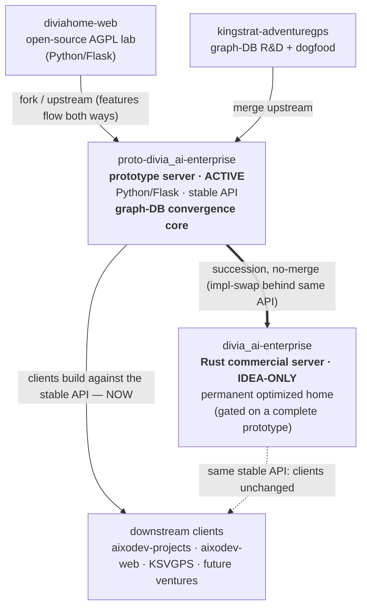

# Brief (Software-Dev) — `divia_ai-enterprise`

> **Software-dev-side brief** → the **AIXO.Dev Platform software-dev knowledgebase** (repos · upstreams · Build Lines · Build Envelopes · Stages/Phases/Sprints · convergence · license). Paired **[business brief](../ULTIMATE_VISION/PRODUCTS/DiviaAI/divia_ai-enterprise.md)** (the `Company → Product` overlap anchors both). Each `##`/`###` section is bounded so it maps cleanly to a graph-DB node/edge. **This entity is the portfolio's graph-DB convergence core** — see `ARCHITECTURE_CONVERGENCE.md`.

## Project / repos

This Product is delivered by **two Build Lines on two repos** (succession, no-merge — different stacks). The active one is the Python/Flask prototype; the future one is the Rust commercial server.

| Field | Value |
|---|---|
| **Active repo / dir** | `proto-divia_ai-enterprise` *(the Python/Flask prototype — the live integration target)* |
| **Active GitHub** | `@DiviaAI/proto-divia_ai-enterprise` · `git@github.com:DiviaAI/proto-divia_ai-enterprise.git` |
| **Future repo / dir** | `divia_ai-enterprise` *(the Rust commercial server — IDEA-ONLY, not yet a real repo)* |
| **Future GitHub** | `@DiviaAI/divia_ai-enterprise` *(planned; begins after the prototype reaches v1 + ~30 days real use)* |
| **Techstack (prototype)** | Python 3.12+ · Flask (app factory + Jinja2 + Blueprints) · SQLAlchemy 2.0+ · SQLite → PostgreSQL · Flask-Migrate (Alembic) · pydantic-settings · `uv` · pytest + Ruff |
| **Techstack (Rust server)** | Rust *(idea-only; details TBD — earlier exploration mentioned Tokio / DiviaMesh-WebSocket sync / Loro-CRDT / an eventual RosettaMQ base, but none are committed in source)* |
| **Document format** | DVAI Document Format (`.dvai`) — SQLite-based; hybrid storage (relational rows primary; round-trip `.dvai` import/export a first-class goal) |
| **License (both Build Lines)** | **Closed / commercial — proprietary, © 2026 Divia.AI, Inc.** (see `## Engine license` below) |
| **Maps to business Product** | Divia.AI Enterprise *(see [business brief](../ULTIMATE_VISION/PRODUCTS/DiviaAI/divia_ai-enterprise.md))* |

## Build Lines · Build Envelopes · Triangulation Target

| Build Line | Build Envelope | Role / status |
|---|---|---|
| **`proto-divia_ai-enterprise`** (Python/Flask prototype) | "Seed/Lab" (fast-iteration Python/Flask · SQLite→Postgres · "everything easily changeable") | **ACTIVE.** The stable-API-target prototype of the Enterprise server; the live integration surface clients build against **now**. Phase 00 PENDING (no app code yet). |
| **`divia_ai-enterprise`** (Rust commercial server) | "Enterprise" (Rust · higher-performance · locked-down · IT-administered company server) | **IDEA-ONLY.** The "real" production server — the single, permanent, optimized home of the core. Gated: begins only after the prototype reaches working v1 + ~30 days of real-world use. |

- **Relationship between the two Build Lines:** **succession, no-merge** — the Rust server is a higher-performance, locked-down build of the *exact same product*, the only planned difference being Python (prototype) vs. Rust (commercial) source. They do not share a codebase; the Rust build is a re-implementation behind the same **stable API** (so it is an implementation-swap clients don't feel).
- **Triangulation Target (the core):** the **single, permanent, optimized home** of the portfolio's core capabilities (graph-DB, knowledge model, task management, research-documentation handling) — the Rust commercial server, reached via the prototype. Everything else in the portfolio is a client of it.

## Convergence chain & the "downstream clients, not copies" principle

This entity is the **convergence hub** of `ARCHITECTURE_CONVERGENCE.md`: the same core capabilities (graph-DB, knowledge model, task management, research-doc handling) that would otherwise be re-implemented across ~5 repos are **concentrated HERE instead**, and every other product **depends on it as a client**. Two payoffs: (1) deep optimization (graph-DB performance work) happens once, in the server; (2) entering the *actual* KingStrat companies/entities/domains into the graph *is* the graph-DB acceptance test — so "the engineering is correct" and "stakeholders see a working KSVGPS service" become the **same** deliverable.

- **Lineage:** `diviahome-web` (open-source AGPL lab) → **`proto-divia_ai-enterprise`** (the Enterprise-server prototype; a `diviahome-web` fork that tracks it as upstream) → downstream **clients** (`kingstrat-adventuregps` / KSVGPS, `aixodev-projects`, `aixodev-web`, and future venture clients).
- **Downstream projects are CLIENTS of this core, not copies.** Core functionality concentrates here; clients build against the prototype's **stable API** (the contract). When the Rust rewrite lands it is an implementation-swap *behind the same API*, so clients do not change.
- **Issue-routing keeps client scope clean:** a server-side issue surfaced by client work is fixed **in `proto-divia_ai-enterprise`** (or noted already-fixed in the Rust server), never duplicated in the client.
- **The graph-DB R&D is dogfooded upstream in `kingstrat-adventuregps`** (its Phase-00 spikes prove the graph-DB seams on KingStrat's real data), then **merges upstream into this prototype**. *(See the [kingstrat-adventuregps engineering brief](kingstrat-adventuregps.md).)*

## Stages → Phases → Sprints

**Phase 00 — Ideation & Research (PENDING)** on the active prototype. The repo was cloned from `diviahome-web` (shared git history); workflow system, specs scaffold, and project guide are in place — **no application code, phases, or sprints exist yet**. First Phase-00 jobs: settle the DDF storage model (app-DB-authoritative vs `.dvai`-authoritative, and the SQLite-`.dvai`-vs-Postgres-portability tension), the scan-and-import architecture, and the v1 vertical-slice scope. (Standard pipeline: New Phase → Sprint Planning → Human Review → Execution → Code Review → Closeout; branches `claudecode/@claude/phase{NN}-sprint{NN}`; commits prefixed `P{NN}-S{NN}-T{NN}`.) The Rust Build Line has no Stages yet (idea-only).

## Git topology / lineage

- **Remotes (active repo):** `origin` = `@DiviaAI/proto-divia_ai-enterprise`; `upstream` = `@DiviaHome/diviahome-web` (the open-source lab).
- **Branches:** `diviahome-main` = the **pristine upstream mirror** of the DiviaHome lab; `main` = the **Enterprise prototype line** (the delta over the lab). Stable lab releases are pulled only from `upstream` `main` (the "stability gate"); general-purpose features built here graduate **up** to the lab via PR, then come back down through the mirror (the "atomic swap").
- **Downstream consumer:** `kingstrat-adventuregps` mirrors this repo (it is the downstream client; its `main` tracks this prototype). *(See `GIT-BRANCHING.md` in the repo for the full topology.)*

## Engine license (closed/commercial — both Build Lines)

- **Both** the Python/Flask prototype **and** the future Rust server are **proprietary, closed-source, commercial** products of Divia.AI, Inc. (© 2026). Neither is open-source; neither is AGPL; neither is dual-licensed. No license is granted except under separate written agreement with Divia.AI, Inc.
- **The AGPLv3 + Commercial dual-license belongs ONLY to the upstream ancestor `diviahome-web`** (the open-source lab — so home/self-host users can install it). That open-source licensing **does NOT flow down** to `proto-divia_ai-enterprise` or to the Rust `divia_ai-enterprise`: features that flow down from the DiviaHome lab into the Enterprise server become part of the proprietary product line. Conversely, any general-purpose work intended to be open-sourced must be contributed **up to the DiviaHome lab** (where the AGPL+Commercial terms apply), not released from here.
- Downstream clients carry their own product licenses (e.g. KSVGPS is a proprietary internal web service); the *engine* they run on is this closed/commercial server.

## `[DEALBREAKER-HOOK]`s

- **Placeholder global-identity fields in v1** — carried now so the future **Divia.AI Global (SaaS)** identity/auth (global username, federated home + work servers) layers in without a painful migration. (Cheap now; catastrophic to retrofit.)
- **A deliberately stable API surface** — the prototype's contract is what lets the far-future Rust rewrite be an implementation-swap and lets clients build against it in parallel today. Getting the API boundary right early is the irreversible fork.
- **Postgres-portable schema + Alembic migrations** — avoid SQLite-specific features that won't translate to PostgreSQL (note the live tension with the SQLite-based `.dvai` format — a Phase-00 resolution target).
- **The graph-DB seams** dogfooded in `kingstrat-adventuregps` and merged upstream here (the canonical-event envelope, source-neutral IDs, etc. — detail in the kingstrat engineering brief) are the irreversible architecture this core converges on.

## Open questions (TBD — from `ARCHITECTURE_CONVERGENCE.md` / source files)

- The precise **API boundary and versioning policy** (John's to decide).
- How much of the graph-DB **cross-project inventory** lives in the server vs. in `aixodev-projects`.
- The **timing of the Rust rewrite** (gated on a complete prototype + ~30 days use).
- Rust-server internals (Tokio / DiviaMesh / Loro-CRDT / RosettaMQ) are **idea-only**, not committed in source.

## Cross-references

- Paired business brief: [`../ULTIMATE_VISION/PRODUCTS/DiviaAI/divia_ai-enterprise.md`](../ULTIMATE_VISION/PRODUCTS/DiviaAI/divia_ai-enterprise.md).
- Architecture: [`../ARCHITECTURE_CONVERGENCE.md`](../ARCHITECTURE_CONVERGENCE.md) · [`../PROJECT-ORGANIZATION-MODEL.md`](../PROJECT-ORGANIZATION-MODEL.md).
- Downstream client + graph-DB R&D home: [`kingstrat-adventuregps.md`](kingstrat-adventuregps.md).
