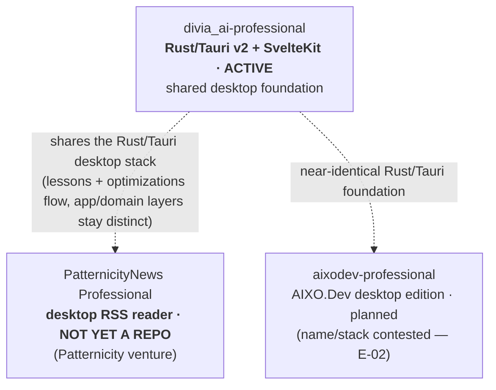

# Brief (Software-Dev) — `divia_ai-professional`

> **Software-dev-side brief** → the **software-dev knowledgebase** (repo · GitHub · techstack · Build Lines · Build Envelopes · Triangulation Target · Stages/Phases/Sprints · lineage · license · `[DEALBREAKER-HOOK]`s). Paired **[business brief](../ULTIMATE_VISION/PRODUCTS/DiviaAI/divia_ai-professional.md)** (the `Company → Product` overlap anchors both). Each `##`/`###` section is bounded so it maps cleanly to a graph-DB node/edge. **This entity's Rust/Tauri desktop stack is the shared foundation the future PatternicityNews Reader will reuse** — see `## Shared desktop stack`.

## Project / repo

| Field | Value |
|---|---|
| **Repo / dir** | `divia_ai-professional` *(some checked-in blocks still say `divia_ai-professional-codex/` — stale residue, [E-14](../ERRATA.md))* |
| **GitHub** | `@DiviaAI/divia_ai-professional` · `git@github.com:DiviaAI/divia_ai-professional.git` |
| **Package** | `divia-ai-professional` (npm) · Cargo workspace crates `divia-core` + `divia-tauri` |
| **Techstack** | **Rust** · **Tauri v2** (desktop shell + Rust command bridge) · **SvelteKit 5** · **TipTap 3 / ProseMirror** (editor) · **SQLite-backed `.dvai`** runtime format · **dual FTS5** (porter + trigram) local search · **Vitest + jsdom** (frontend) + **cargo test** (Rust) |
| **License** | **Proprietary / commercial** — "© 1996–2026 John Stanforth & Divia.AI, Inc. All rights reserved." *(Copyright start-year 1996 vs the brand-era "Divia.AI 2020–present" — drift noted [E-14](../ERRATA.md).)* |
| **Maps to business Product** | Divia.AI Professional *(see [business brief](../ULTIMATE_VISION/PRODUCTS/DiviaAI/divia_ai-professional.md))* |

## Implemented stack (in code, today)

| Layer | Technology | Status |
|---|---|---|
| Desktop shell | Tauri v2 (Rust command bridge) | Implemented |
| Frontend | SvelteKit 5 | Implemented |
| Editor | TipTap 3 / ProseMirror | Implemented *(long-term editor architecture still an open question)* |
| Document format | `.dvai` — SQLite single-file | Implemented |
| Tree model | Adjacency list + **TEXT fractional indexing** for sibling order (`position_first()` / `position_between()`) | Implemented |
| Block schema | Single table, JSON properties (one outline node = one block row) | Implemented |
| Local search | **Dual FTS5** (porter + trigram); content-centric | Implemented |
| Frontend tests | Vitest + jsdom | ~41 tests |
| Rust tests | cargo test --workspace | ~39 tests |

- **Not yet implemented** (planned direction, not current code): collaboration (Loro Tree+Map CRDT is research-favored, not committed; DiviaMesh transport), encryption (SQLCipher / SQLite-MultipleCiphers under consideration; planned 3-tier key hierarchy), semantic/hybrid retrieval (sqlite-vec + Reciprocal-Rank-Fusion — only FTS5 is built), the open-format `.dvai-open` mirror / dual-format-authority model, and a workspace model beyond single documents.
- **AI integration (planned):** Claude API with a **user-provided key in the OS keychain** — no bundled model, no autocomplete, no training on user data; opt-in, zero-AI-by-default. *(Test counts vary across docs — 37 vs 39 Rust, 41 frontend — see [E-14](../ERRATA.md).)*

## Build Lines · Build Envelopes · Triangulation Target

| Build Line | Build Envelope | Role / status |
|---|---|---|
| **Divia.AI Professional desktop app** *(this repo)* | "Desktop" (Rust/Tauri v2 + SvelteKit 5 · solo/small team · local-first single-binary app) | **ACTIVE — a real, working desktop app.** Phases 1–2 complete; Phase 03 (rearchitecture / ensemble-collab) in flight. Delivers the Product's desktop Version-Releases. |

- **Single Build Line:** unlike the Enterprise Product (two Build Lines, succession-no-merge) or the platform umbrellas, Pro is **one repo / one Build Line** today. The shared **Rust/Tauri desktop stack** is reused by sibling desktop apps (next section) but those are **separate Build Lines in separate repos** that share lessons/optimizations, not a merged codebase.
- **Triangulation Target:** a mature, trustworthy, local-first outliner-editor that is also the **desktop client of Divia.AI Enterprise** — owning the canonical `.dvai` + DiviaCard implementation the rest of the ecosystem reads and writes.

## Shared desktop stack (the cross-product foundation)

This repo's **Rust/Tauri v2 + SvelteKit desktop foundation is deliberately a shared, reusable base** that future desktop apps clone lessons/optimizations from (hard-won desktop work flows between products while their application/domain layers stay distinct):

- **PatternicityNews Reader** — the future **`PatternicityNews Professional`** cross-platform desktop RSS-newsreader (Patternicity venture; product page `patternicity.news/rssnewsreader/`, redirect `patternicity.pro`) is **slated to share this exact Rust/Tauri desktop stack.** *(This is the headline relationship for this brief. No repo / GitHub remote / Build-Line scaffold for the reader exists yet — "Unknown (not in source files)"; the share is a stated intent, not yet code.)*
- **`aixodev-professional`** — the planned AIXO.Dev Platform desktop edition is *also* meant to share a **near-identical Rust/Tauri foundation** with `divia_ai-professional`, despite being an entirely separate corporate/product family. *(Its name/stack is **contested** — Rust/Tauri "AIXO.Dev Professional" vs Electron "AIXO.Dev Desktop" — see [E-02](../ERRATA.md).)*

## Stages → Phases → Sprints

**Phases 1–2 complete; Phase 03 in flight** (~243 commits per the `_projects/` index; Phase 03 framed as a rearchitecture / ensemble-collab pass). Working checked-in surface: the outliner editor, `.dvai` SQLite persistence, tabs with per-document runtime session state, focus navigation + drag-and-drop, local search + in-editor highlighting, prototype DiviaCards (task + event types), themes, recent files, save indicators, automated validation. Standard pipeline (sprint branches `claudecode/@claude/phase{NN}-sprint{NN}`; commits prefixed `P{NN}-S{NN}-T{NN}`). Validation gate: `npm run check` · `npm run build` · `npm run test` · `cargo test --workspace` (all four must pass).

## Architecture decisions already in code (expensive to reverse)

These are encoded across schema / serialization / search and would be costly to change:

1. **SQLite as primary runtime format** (the `.dvai` single file).
2. **One outline node = one persisted block row** (deeply encoded; "what *is* a block?" is open question GQ-1, not yet ratified).
3. **TEXT fractional indexing for sibling order.**
4. **Single live TipTap editor instance** — destroy/recreate on tab switch (undo history lost on switch).
5. **TipTap JSON as the editor↔persistence interchange** — meaningful editor lock-in risk.
6. **Content-centric FTS5 search** — indexes block content only, not structure/properties.
7. **Hard delete for removed blocks** — schema has `deleted_at` but soft-delete is deferred.

## Lineage / git topology

- **Lineage:** **Unknown (not in source files).** Pro is a Rust/Tauri/SvelteKit application; it is **not** part of the Python/Flask `diviahome-web → proto-divia_ai-enterprise → clients` clone-lineage (that is the *server* chain). No fork-parent for this repo is recorded in the sources read.
- **Remote:** single `origin` = `@DiviaAI/divia_ai-professional`. Branch topology beyond `main` = "Unknown (not in source files)" (deep-read of code/branches was out of scope).
- **Relationship to Divia.AI Enterprise:** Pro is the **desktop client** of the Enterprise server (shared codebase per the business framing) — but Enterprise is a separate Build Line on separate repos (`proto-divia_ai-enterprise` Python prototype → future Rust `divia_ai-enterprise`); see the [enterprise engineering brief](divia_ai-enterprise.md). *(The exact "shared codebase" boundary between a Rust/Tauri desktop app and a Python/Rust server is not spelled out in source — treat as the client-of-a-stable-API pattern, TBD.)*

## `[DEALBREAKER-HOOK]`s

- **The `.dvai` SQLite document-format contract** — `application_id`/`user_version` migration discipline + the FTS5 (and future sqlite-vec hybrid) seam; getting the on-disk format right is the irreversible fork the whole ecosystem reads/writes against.
- **The block model + fractional-ordering seam** ("one node = one block row" + TEXT fractional indexing) — encoded across schema/serialization/search; changing it later is a migration of every document.
- **Editor-interchange lock-in** — TipTap-JSON as the persistence interchange is a known lock-in risk (the TipTap→ProseMirror migration question, [E-11](../ERRATA.md)); the editor-architecture boundary is the irreversible fork still being litigated.
- **`.dvai` LiveDocuments substrate** (from LATER-002) — revision-history + "what changed" diffs living *inside* the SQLite container is the planned substrate for Enterprise "Research Projects"; designing the format to admit it later is cheap now, catastrophic to retrofit. *(Not yet in the repo — [E-12](../ERRATA.md).)*
- **Placeholder global-identity fields** — to let the future Divia.AI Global (SaaS) identity layer in without a painful migration (carried at the ecosystem level).

## Open questions (TBD — from gap-analysis / source files)

- **ADR-002 (WYSIWYG/Typora model)** is cited as the live decision in `CLAUDE.md`/`AGENTS.md` while a *withdrawn* copy sits in `_REFERENCE/ARCHITECTURE/`, and a TipTap→ProseMirror migration is re-opening the "settled" editor — [E-11](../ERRATA.md).
- **Single vs multi-editor architecture** (GQ-3), **editor-state ownership / crash recovery** (GQ-2), **the dual-format authority model** (DQ-1), **undo/redo across the full stack** (DQ-2, currently TipTap-local only), **workspace-vs-document boundary** (DQ-4) — all open PM decisions per the codebase gap analysis.
- **Whether the stack can deliver the "writing-feel" promise** (GQ-4) — no hard proof yet.
- **Lineage / branch topology / the PatternicityNews-Reader and aixodev-professional repo scaffolds** — "Unknown (not in source files)."

## Cross-references

- Paired business brief: [`../ULTIMATE_VISION/PRODUCTS/DiviaAI/divia_ai-professional.md`](../ULTIMATE_VISION/PRODUCTS/DiviaAI/divia_ai-professional.md).
- Conceptual model: [`../PROJECT-ORGANIZATION-MODEL.md`](../PROJECT-ORGANIZATION-MODEL.md) · convergence: [`../ARCHITECTURE_CONVERGENCE.md`](../ARCHITECTURE_CONVERGENCE.md).
- Server it is a client of: [`divia_ai-enterprise.md`](divia_ai-enterprise.md).
- Discrepancies: [`../ERRATA.md`](../ERRATA.md) (E-02 aixodev-professional name/stack · E-05 DiviaCard meaning · E-07 brand/`.dvai` spelling · E-08 Enterprise↔Swarm · E-11 ADR-002 / capability-ahead-of-reality · E-12 LiveDocuments · E-14 test-count, `-codex`-dir & copyright drift).
