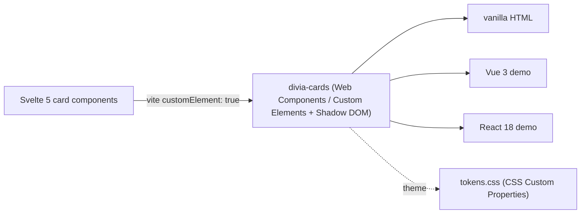

# Brief (Software-Dev) — `divia_cards`

> **Software-dev-side brief** → the **software-dev knowledgebase** (repo · techstack · the card-type vocabulary/schema · how other apps embed it · Build Lines · lineage · license · `[DEALBREAKER-HOOK]`s). Paired **[business brief](../ULTIMATE_VISION/PRODUCTS/DiviaCards/divia_cards.md)** (the `Company → Product/Standard` overlap anchors both). Each `##`/`###` section is bounded so it maps cleanly to a graph-DB node/edge. *(Software-dev briefs live in `_REFERENCE/SOFTWARE_DEV/`, kept in MetaProject per the bootstrap decision. Engineering content migrated out of the old single-file business brief.)*

## Project / repo

| Field | Value |
|---|---|
| **Repo / dir** | `divia_cards` |
| **GitHub** | **No GitHub remote yet** (local repo only; 4 commits, Nov 2025). |
| **npm packages** | **`divia-cards`** `0.1.0` — the publishable Web Components (`web-components/`); **`divia-cards-frontend`** `0.1.0` `private` — the SvelteKit app (`frontend/`). |
| **Techstack (backend)** | Python 3.11+ · Flask 3.x · Flask-SQLAlchemy 3.x · SQLite · Flask-Migrate 4.x · Flask-JWT-Extended 4.x · Flask-SocketIO 5.x · eventlet |
| **Techstack (frontend)** | Svelte 5.x · SvelteKit 2.x · Vite 5.x · **vanilla CSS + CSS Custom Properties (design tokens)** · socket.io-client 4.x · TypeScript 5.x |
| **License** | Root **Undocumented**; the `web-components/` sub-package is **MIT** (per its `package.json` + README). |
| **Build provenance** | Built **Nov 2025 by Factory.ai's "droid" CLI**, **Gemini-3-Pro-reviewed** — the **one repo built outside the Claude / aixodev workflow system** (toolchain-lineage question is open). |
| **Maps to business Product/Standard** | DiviaCards / Divia.AI Semantic Smart Cards (the [business brief](../ULTIMATE_VISION/PRODUCTS/DiviaCards/divia_cards.md)). |

## The card-type vocabulary / schema (the centerpiece)

A **DiviaCard** is a typed content block: a `card_type` discriminator + a JSON `content` payload whose shape is fixed per type. The backend `Card` model stores `card_type` (`'outline' | 'nlp_input' | 'event'`), a JSON `content` column, `user_id`, `created_at`/`updated_at`, and `display_order` (newest-first). `Card.validate_content` does polymorphic per-type validation. **Three implemented card types:**

| `card_type` | Custom Element | `content` JSON schema |
|---|---|---|
| **`nlp_input`** | `<divia-nlp-input-card>` | `{ "text": string }` — a single free-text string ("the raw text input that was previously sent via SMS"). The Activity-Log NL-capture primitive. |
| **`outline`** | `<divia-outline-card>` | `{ "title"?: string, "items": Array<{ "level": number, "text": string }> }` — a **flat** list with a `level` integer for indentation depth (not recursive/nested). |
| **`event`** | `<divia-event-card>` | `{ "name": string, "description"?: string, "location"?: string, "start_time"?: string, "end_time"?: string, "attendees"?: string[] }` |

- Every Custom Element also takes a `timestamp` (ISO-date string) attribute and a `content` attribute carrying the JSON payload **as a stringified string** (parsed internally via a Svelte 5 `$derived` signal).
- **Namespacing status:** this app's `card_type` is a flat string (`outline`/`nlp_input`/`event`) — it contains **no `DiviaCard::Producer::type` namespacing or registry**. The ecosystem's namespaced token form (`DiviaCard::PatternicityNews::article`) is the *standard's* design, **not implemented here** (see `[DEALBREAKER-HOOK]`s + ERRATA E-05).

## How other apps embed it (the distribution model)

The signature move: **Svelte 5 card components compile to framework-agnostic Web Components** (`customElement: true` + `<svelte:options customElement="...">`), so one card definition renders identically anywhere.

- **Distribution:** `npm install divia-cards` → import `divia-cards` (the Custom Elements) + `divia-cards/tokens.css` (the theme tokens).
- **Embedding:** drop `<divia-nlp-input-card content='{"text":"…"}' timestamp="…">` into **vanilla HTML, Vue 3, or React 18** — all three have **working demo apps** in `examples/` (`vue-test`, `react-test`).
- **Encapsulation:** Custom Elements + **Shadow DOM** isolate styles; theming is done purely via **CSS Custom Properties** (`--divia-primary`, `--divia-card-bg`, `--divia-card-radius`, …) — chosen over Tailwind **specifically because CSS variables pierce Shadow DOM** while utility classes do not. Includes automatic dark-mode via `@media (prefers-color-scheme: dark)` and a manual `.dark` parent class.
- **Known gap:** the exported **Web Components are read-only** (display-only embeds) — they lack the edit/delete logic of the full SvelteKit app. The full interactive app additionally has JWT auth, real-time SocketIO card broadcasts (`card_created`/`updated`/`deleted` to per-user `user_{id}` rooms), and REST CRUD (`/api/cards`, `/api/auth`).

## Build Lines · Build Envelopes · Triangulation Target

| Build Line | Build Envelope | Role / status |
|---|---|---|
| **`divia_cards` rendering layer** (this repo) | "Prototype Freedom" (Flask + SvelteKit · SQLite · solo, droid-built) | The original typed-card **rendering app + Web-Components library** — fully built & tested, currently dormant. The name-source for the ecosystem term. |
| *(forward / open)* **DiviaCards as the ecosystem standard** | TBD | The namespaced cross-app `DiviaCard::Producer::type` vocabulary + registry that consumers depend on. **Not yet built here**; reconciliation with this repo is undecided. |

- **Triangulation Target:** a single card vocabulary + rendering layer such that *one card definition renders identically across every ecosystem surface* (Professional/SvelteKit · DiviaHome/Jinja · Divia.Life/Flutter-webview · DiviaContacts/Gmail), with producers publishing namespaced types to a shared registry. **(Aspirational; this repo proves only the rendering-layer slice.)**

## Stages → Phases → Sprints

Built as a **5-phase plan** (`PLAN.md` → `PLAN-v2.md`, the v2 swapping Tailwind for vanilla-CSS design tokens): **P1** Foundation (Flask app-factory, User model, JWT) · **P2** Core (Card model, CRUD, SocketIO real-time) · **P3** additional card types + inline edit · **P4** Web-Components export (Vite `customElement`) · **P5** cross-framework testing (Vue + React demos). **All phases complete**; **25 passing backend tests** (CODE_REVIEW reports ~100% backend coverage). Currently **dormant**. Known minor gaps from `CODE_REVIEW.md`: pagination exists in backend/store but the UI lacks Next/Prev controls; `OutlineCard` empty-save fails silently; JWT blocklist is **in-memory** (should be Redis for prod).

## Git topology / lineage

- **Local only** — 4 commits (Nov 2025); no GitHub remote.
- **Toolchain lineage is the distinctive fact:** the **only repo built outside the Claude / aixodev workflow system** (Factory.ai droid + Gemini-3-Pro review). It is **not referenced by any sibling repo's `_REFERENCE/_EXTERNAL/`** — it predates and stands apart from the ecosystem framing. The open decision: fold it into the workflow system as the standard's rendering layer, or keep it as an independent experiment.

## `[DEALBREAKER-HOOK]`s

- **Namespacing / registry seam (the big one).** The ecosystem standard needs `DiviaCard::Producer::type` namespaced tokens + a registry (`DiviaCard::PatternicityNews::article`, `DiviaCard::LegendaryMoney::transaction`). This repo's flat `card_type` string has **no namespacing**; bolting namespacing + a registry onto the rendering layer (vs. re-deriving it) is the irreversible fork — and the unresolved **E-05 reconciliation** is exactly this hook.
- **The Web-Components-as-the-render-contract bet.** "One card definition → framework-agnostic Custom Element, themed only via Shadow-DOM-piercing CSS variables" is the cross-surface render contract; if the standard adopts it, that compilation + token architecture is the seam every consumer depends on. *(Editable Web Components, `::part()`/`:host` external theming, and Constructable Stylesheets are the noted future build-side work to make the contract richer.)*

## Cross-references

- Paired business brief: [`../ULTIMATE_VISION/PRODUCTS/DiviaCards/divia_cards.md`](../ULTIMATE_VISION/PRODUCTS/DiviaCards/divia_cards.md).
- Conceptual model: [`../PROJECT-ORGANIZATION-MODEL.md`](../PROJECT-ORGANIZATION-MODEL.md).
- Owning venture: [`../ULTIMATE_VISION/VENTURES/DiviaAI.md`](../ULTIMATE_VISION/VENTURES/DiviaAI.md).
- Discrepancies: [`../ERRATA.md`](../ERRATA.md) (E-04 status · E-05 name overload / namespacing-registry gap).
