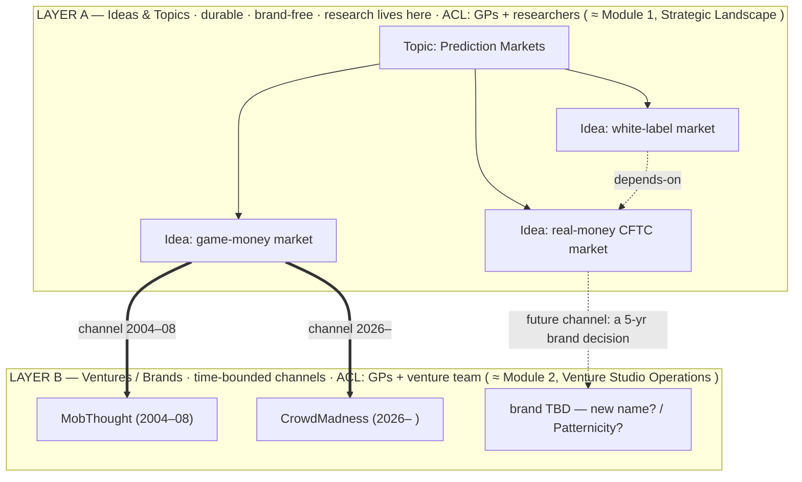

# Strategic-Landscape Model — Ideas & Topics (Layer A), and the Venture channel-symlink

> **Canonical model for KSVGPS Module 1 (the "Strategic Landscape").** Co-developed by John + Claude, 2026-06-22. Companion to [`PROJECT-ORGANIZATION-MODEL.md`](PROJECT-ORGANIZATION-MODEL.md) — that doc is really **Layer B** (Ventures, Products, Build Lines, the engineering structure); *this* doc is **Layer A** (durable, brand-free Ideas & Topics) and the **channel-symlink** that connects them. Draft v1 — the markdown bootstrap (this doc + the `ULTIMATE_VISION/IDEAS/` and `ULTIMATE_VISION/TOPICS/` trees) is the manual proto-version of the future KSVGPS graph-DB.

## The two layers

- **Layer A — Ideas & Topics** (durable, brand-free; KSVGPS **Module 1**). Ideas live here from the moment John thinks of them, carry their **own accumulated research and nightly-agent ideation**, and persist regardless of any brand.
- **Layer B — Ventures & Brands** (time-bounded channels; KSVGPS **Module 2**, "Venture Studio Operations"). Everything [`PROJECT-ORGANIZATION-MODEL.md`](PROJECT-ORGANIZATION-MODEL.md) already covers: companies, brands, Product Lines, Products, Product Version-Releases, Build Lines, Build Envelopes, Stages→Phases→Sprints, domains, teams.
- **The join edges (revised 2026-06-23):** the **Idea↔Venture reference edge** (this doc) is a *non-owning* sideways graph link, **not** an ownership channel; the only ownership *symlink* in the model is the existing **Version-Release → [Build-Line→Stage]** pointer *inside* a Venture (see [`PROJECT-ORGANIZATION-MODEL.md`](PROJECT-ORGANIZATION-MODEL.md)). The Venture owns the Build-Lines — see the ownership section below.

## Node-types & edges (Layer A)

- **Topic** — a node in a **taxonomy** (e.g. "Real Estate", "Prediction Markets"), with parent/child topic edges.
- **Idea** — an actionable concept, **tagged many-to-many to ≥1 Topic** (a "real-estate prediction market" idea spans both). The research attaches to the Idea, not the brand.
- **Idea↔Idea edges:** `depends-on` (the white-label needs the real-money market first), `variant-of` / *same-idea-different-scale* (small-AVM ≈ National-AVM), `enables` (a news-in-a-graph idea → an event-monitoring idea), `successor-of` / `historically-owned` (the decade-arc, MobThought→CrowdMadness).
- **The same-idea-vs-new-idea test** (confirmed): *same Idea* = the same customer-value/concept at a different **scale or timing** (small-AVM ≈ National-AVM); *new Idea* = a **materially different app / customer / regulatory regime** (game-money vs. real-money market; AVM vs. ADU-advisory).
- **Future ontology node-types (graph-DB era — documented, not yet built):** **Thesis** (a falsifiable claim/bet the portfolio makes, e.g. *"fractional home-ownership goes mainstream this decade"*) and **Event / Phenomenon** (a real-world trend/headline the portfolio reacts to, e.g. *"the ~$30T generational wealth-transfer"*). These will join Ideas, Ventures, and Build-Lines by typed non-owning edges (`supporting-evidence-for`, `depends-on`, `motivated-by`). For the v0.5 markdown/SQLite bootstrap, Layer A stays **Topic + Idea**; Thesis / Event land when the real graph-DB (KSVGPS) does.

## The Idea↔Venture reference edge (non-owning, optionally time-bounded)

*(Non-owning: this edge links an Idea to a Venture that pursues it; the Venture still owns all of its own Build-Lines, Repositories, and Product-Lines — see the ownership section below. "Channel" is kept as informal shorthand for this reference edge, not an ownership transfer.)* A **reference edge** records a *time-bounded association of an Idea to the Venture/brand that currently embodies it* — e.g. the prediction-market idea's channel was **MobThought (2004–08)**, is **CrowdMadness (2026– )**, and for the real-money idea is a **future, undecided brand**. The Idea (and its research) stays put; the brand under it changes. A Venture can host **several** Ideas as business-lines; an Idea can move between Ventures over time.

**Detach-and-reuse (the reuse engine):** when a channel ends — a venture pauses, dissolves, or *pivots* — the Idea **detaches back to Layer A intact** and remains reusable. If CrowdMadness ever became real-money-only, the game-money Idea would simply sit back in the Strategic Landscape, available later (e.g. a foreign-market game under different regulation). This is the same dynamic as MobThought's ideas/IP surviving its 2008 pause to power CrowdMadness now.

## Ideas connect to Ventures by non-owning edges — the VENTURE owns the Build-Lines (revised 2026-06-23)

**This reverses the earlier "Build Lines are owned by the durable Idea" model.** Ownership must be **concrete and legible to capital**: LPs fund a *Venture*, and that Venture's cap table, asset assignment, and employee equity all key to the fact that **the Venture owns its software assets** — Build-Lines, Product-Lines, and Repositories. An abstract Idea cannot sit on a cap table, so it cannot *own* a Build-Line. The Idea/Topic ontology therefore lives **off to the side** and connects to the venture structure only by **non-owning graph edges** (M2M): a Venture (and, optionally, a Build-Line or Product-Line) *relates-to / realizes / is-motivated-by* one or more Ideas/Theses/Events — but owns none of them, and they own none of it.

- **The Venture owns the Build-Lines** (and Product-Lines and Repositories). A Build-Line does **not** travel from one Venture to another when "the same idea" is pursued elsewhere — it is a venture asset. Two Ventures pursuing the same Idea (MobThought 2004–08 and CrowdMadness 2026– ) are **two separate Ventures that both link to the same Idea/Thesis nodes**; each builds (or acquires, via a real business transaction) its own Build-Lines. The MobThought→CrowdMadness "reboot" is a **shared-Idea link, not a Build-Line that moved**.
- **Ideas remain durable and reusable** (Layer A): the Idea and its research persist regardless of which Ventures reference it, and a new Venture can pick it up later. What is reusable across ventures is the **Idea / IP / research**, not the prior venture's code assets.
- A Build-Line still carries its **research/optimization-scope flag** — *playground* (`research=OFF`: hands-off, vibe-code-now) vs. *optimization-target* (`research=ON`), the engineering SortingHat — and a single Idea can still motivate **several Build-Lines across scale** (the AVM Idea ↔ FracRealHomes' EstimatePacket *and* National-AVM lines), but those Build-Lines are **owned by the FracRealHomes Venture** and merely *linked* to the AVM Idea by a non-owning edge.

**Revised ownership chain:** `Venture ──owns──▶ { Build-Line ──uses⇄── Repository ; Build-Line ▶ Stage ▶ Phase ▶ Sprint ; Product-Line ▶ Version-Release ──realized-by──▶ [Build-Line→Stage] }`, with the **Idea / Topic / (future) Thesis / Event ontology to the side**, joined by non-owning M2M edges. (Engineering-side detail: [`CODEMAP-AND-SHARED-FRAMEWORK-MODEL.md`](CODEMAP-AND-SHARED-FRAMEWORK-MODEL.md) §4.)

## Inter-venture relationships — the Divia.Network protocol edge (not corporate siblinghood)

Ventures relate to *each other* in the model by only two kinds of edge, **neither of which is corporate siblinghood** (John, 2026-06-24):

- **Non-owning Idea edges** — two Ventures that reference the same Layer-A Idea/Thesis/Event (MobThought ↔ CrowdMadness sharing the prediction-market Idea). Covered above; this is the cross-venture-reasoning engine.
- **The Divia.Network protocol edge** — a Venture is a **tech-client / adopter of the Divia.Network open standard** (it supports **DiviaCards** + the AI use-cases), exactly as a web app "speaks http." It is *not* a parent/child or sibling corporate relationship.

So the portfolio startups (AIXO.Dev, ExoDev.Pro, Patternicity, FracRealHomes, TastyPal, LegendaryMoney, …) are **independent companies that happen to be Divia.Network / DiviaCards-compatible — NOT "Divia companies," and NOT a product suite** (deliberate, to avoid the "1990s Microsoft Office Suite" perception; each is its own standalone consumer-facing startup with its own daily-operational team). What they may share is at most an **overlapping-Venn of KingStrat-LP ownership** — a cap-table fact, not official siblinghood. (Engineering framing: [`SOFTWARE_DEV/divia_network.md`](SOFTWARE_DEV/divia_network.md); the worked write-up is the [Patternicity brief](ULTIMATE_VISION/PRODUCTS/Patternicity/patternicity.md) "Divia.Network relationship" section.)

## The dimensional axes, re-homed onto the two layers

The earlier "an idea is a multi-dimensional object" axes still apply — they sort onto the right layer:

- **On the Idea (Layer A):** **Conviction** (active-build → … → defensive-only), **Horizon** (now → … → never/defensive), **Provenance** (head / newsletter / voicenote / brainstorm / domain-grab / agent-correlation), **Leverage** (what techstack / validation-playbook / Build-Envelope / compliance-regime it reuses).
- **On the Venture instantiation (Layer B):** **Wave** (1st/2nd/3rd — Cringely, `R-005`), **Founder-fit** (me+Claude-only → … → not-me-at-all).
- **Cross-cutting registries:** an **IP-asset registry** (domains/trademarks — e.g. `patternicity.bet`, which can attach to an *Idea* as a defensive option AND to a *Venture* as a redirect) and a **market-context** layer (competitors, category-maturity, regulatory state — time-varying, agent-tracked).

## ACL scoping (the clincher that forces the split)

A firm **researcher** (e.g. a UCLA professor advising on prediction-market economic theory) gets **Layer A** — the Topic + Ideas + research — but **not** the Ventures (he works years ahead of any brand/team). A **GP** gets both layers. Separate ACL scopes are only expressible if Idea and Venture are **separate entities** — which is the single hardest requirement and the reason the two layers can't collapse into one "venture brief."

## Correlation & matching (why durable Ideas pay off)

Because the Idea/Topic list is durable and brand-free, a future-Claude (and the **nightly autonomous "dreaming" agent**) can instantly reference the whole landscape to place any **new input**: a newsletter item → *"this matches the game-money Idea"*; a technique → *"this shortens the path to CFTC-compliance, reducing the work to reach the real-money Idea"*; a stray idea → *"this is a new Idea under the Real-Estate Topic, sibling to the AVM."* This is the engine behind cross-venture reasoning and the [future-scenario workflow](../_workflows/workflow_cross_venture_future_scenario.md).

## Where it lives (the bootstrap layout)

- This model: `_REFERENCE/STRATEGIC-LANDSCAPE-MODEL.md`.
- **Layer A nodes:** `_REFERENCE/ULTIMATE_VISION/TOPICS/` (the taxonomy) and `_REFERENCE/ULTIMATE_VISION/IDEAS/` (the idea nodes) — *alongside* the venture `PRODUCTS/` tree (Layer B). Seeded so far with two worked examples: **Prediction Markets** (game-money / real-money-CFTC / white-label) and **Real Estate** (AVM / ADU-advisory).
- These markdown nodes are the **proto-graph-DB**: each `##`/bullet is shaped to map to a future node/edge.

## Status

Draft v1 (2026-06-22); **ownership revised v1.1 (2026-06-23): the VENTURE owns Build-Lines / Product-Lines / Repositories; Ideas are a side ontology joined by non-owning M2M edges (reversing the earlier "Build Lines owned by the Idea").** Applies cross-venture. Iterated through discussion; the worked-example trees validate it from two domains. Feeds [`R-003`](../_backlog_TODOs/RESEARCH-BACKLOG.md) (the graph-DB schema). Cross-refs: [`PROJECT-ORGANIZATION-MODEL.md`](PROJECT-ORGANIZATION-MODEL.md) (Layer B) · the [intro-brief](../_workflows/workflow_new_venture_intro_brief.md) and [future-scenario](../_workflows/workflow_cross_venture_future_scenario.md) workflows.
