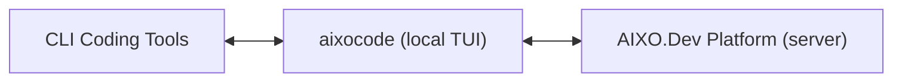

# Brief (Business) — AIXO.Dev Platform (ExoDev.AI)

> **Business-side brief** → the **AIXO.Dev company/product knowledgebase** (corporate umbrella · subsidiary entities · brands · Product Lines / Products · GTM · domains · Product Version-Releases). Self-contained (domains + cross-refs pulled in). Its **software-dev facet** (the platform *as* the software-dev knowledgebase — repos · Build Lines · Build Envelopes · techstack · convergence) is the paired **[engineering brief](../../../SOFTWARE_DEV/aixodev-platform.md)**. Each `##`/`###` section is bounded so it maps cleanly to a graph-DB node/edge. **Platform-level brief** — an umbrella over multiple repos, *not* a single-repo brief. *(Batch-1 software-dev knowledgebase — the engineering peer to KSVGPS's business knowledgebase.)*

## Identity

| Field | Value |
|---|---|
| **Product (full)** | AIXO.Dev Platform |
| **Wordmark** | AIXO.Dev · the platform surface is "AIXO.Dev Platform (Web)" internally |
| **One-line** | "Linear + GitHub + Slack for human-AI development teams" — a platform where AI agents are full team members with persistent personalities, assigned tasks, and tracked contributions, working alongside humans across hundreds of projects over years. |
| **Framing metaphor** | The "Palantir analog" pairing: a **Foundry-style platform** pulled through by a **forward-deployed engineering consultancy.** "Bring back the joy of engineering." |
| **Distinctive role (Batch 1)** | This platform **IS the software-dev knowledgebase** — the peer to KSVGPS's business knowledgebase. It models every project / repo / upstream + Build Lines · Build Envelopes · Stages/Phases/Sprints + dev-team discussions, in extreme detail. |

## Company / corporate structure · Brands

> ⚠️ **Corporate naming is unresolved — three competing identities** (see [`../../../ERRATA.md` E-01](../../../ERRATA.md)). The top of the corporate tree is named three different ways and the newest version explicitly retires the oldest. This brief surfaces all three rather than silently picking a winner — **a John decision is pending.**

- **Top entity (contested, three sources):**
  - **ExoDev.AI, Inc.** — per John's global `CLAUDE.md` + the in-repo `aixodev-aixocode/CLAUDE.md` (the live operating instruction; uses the oldest name).
  - **ExoDev.AI Corporation** / **ExoDev.AI Corp.** — per `aixodev-aixocode/_REFERENCE/PRODUCT_AND_NAMING.md` and this MetaProject's `DOMAIN_MAPPINGS.md` ("ExoDev.AI Corp.", domain `exodev.ai`).
  - **ExoDev.Pro, Inc.** (Dallas HQ, founded 2026) — per the `aixodev-web` Phase-D research canon (Apr 2026, marked DRAFT/internal), which *explicitly retires* "ExoDev.AI." The "Palantir analog" that runs the consulting business.
- **Product subsidiary (the "Foundry analog"):** **AIXO.Dev Platforms LLC** (note plural; "An ExoDev.AI Company") — owns the software platform. *(John's `CLAUDE.md` author field uses the singular "AIXO.Dev Platform LLC"; the Phase-D canon and PRODUCT_AND_NAMING use plural "Platforms LLC.")*
- **Regional services subsidiaries (the consultancies — the first/internal customers):**
  - **ExoDev.Pro - Dallas** (a.k.a. `ExoDev.Pro - Dallas, LLC`).
  - **ExoDev.Pro - Los Angeles** (a.k.a. `ExoDev.Pro - Los Angeles, LLC`).
  - **ExoDev.Pro - Chicago, LLC** — present in `DOMAIN_MAPPINGS.md` (subdomain `chicago.exodev.pro`); part of the planned expansion.
  - Planned expansion "to other cities in late 2026 / early 2027" (Phase-D names future NYC, Chicago, Ireland).
- **Brands:** corporate front = *ExoDev* / *ExoDev.Pro*; platform product = *AIXO.Dev Platform*; the consultancies operate as *ExoDev.Pro - {City}*.

## Product Lines → Products

- **Product Line:** the **AIXO.Dev Platform** — a platform for human + AI software-development teams (multi-tenant SaaS, with a Regulated-OnPrem tier). The corporate parent's **primary client-engagement + software-project-development platform.**
  - **Product: AIXO.Dev Platform (Web)** (`aixodev-web`) — the central server/hub: projects, issues, AI-session transcripts, per-project wiki, GitHub integration, real-time notifications, analytics, session-ingest API. *The strategic core and merge target.*
  - **Product: `aixocode`** — the shipping laptop-side TUI; the power-user bridge between CLI coding tools and the platform. *(Open-core: MIT — the only MIT product among proprietary AIXO.Dev siblings. Gets its own brief in a later batch.)*
  - **Product: AIXO.Dev Professional** — the *planned* cross-platform desktop edition. *(Name/stack contested — see [`../../../ERRATA.md` E-02](../../../ERRATA.md); gets its own brief in a later batch.)*
  - **Planned clients (future):** AIXO.Dev for macOS/Linux (desktop), iPad/Android (tablet), iOS/Android (mobile).
  - *Other platform components — `aixodev-codemap`, `aixodev-collabs`, `aixodev-openhands`, `aixodev-projects`, `aixodev-workgroups` — are engineering Build Lines / prototypes that converge into the platform; they live in the **[engineering brief](../../../SOFTWARE_DEV/aixodev-platform.md)** and get their own briefs in a later batch.*

## Architecture position (one-line)

`aixocode` runs on the developer's laptop, captures session data losslessly, and syncs to the AIXO.Dev Platform server. *(Engineering detail → the [engineering brief](../../../SOFTWARE_DEV/aixodev-platform.md).)*

## Go-to-market / strategic role

**Two intertwined revenue motions** (Phase-D research, Apr 2026 — aspirational/DRAFT):

1. **The AIXO.Dev Platform (software).** Per-seat SaaS. Positioned as "Linear + GitHub + Slack for human-AI development teams." Claimed category: **"Forward-Deployed Engineering Platform."**
2. **Forward-Deployed Software Engineering (consulting).** The Palantir-style motion: **FDSEs embed 3–4 days/week** in a client org, ship a production workflow on the client's real data by engagement day 5, then **"graduate"** the client's own engineers to solo operation by week ~8 and leave. Consulting funds the platform; the platform's IP compounds vendor-side across engagements.

- **Pricing (Phase-D, aspirational):** 5-tier per-seat SaaS — Starter $40 / Team $75 / Business $125 / Enterprise $175–225 / Regulated-OnPrem $225–350 per seat/mo (+ on-prem infra $150–400K/yr). A fixed **$20K, 5-day paid "AIXO Deployment Week"** is the top-of-funnel pilot (target ≥40% convert in 60 days). Engagements list $50K–$400K/mo. BYOK token policy (no markup).
- **Key metrics (Phase-D, aspirational):** north-star **WPAA** (Weekly Production Agent-Actions, human-approved); single most diagnostic KPI = **Graduation Rate** (target ≥60% of first 10 clients, ≥70% by #20; "<50% = business model in jeopardy"). Targets NRR 140%+, LTV:CAC 30:1+; revenue $6–9M (2026) → $90–130M (2028) → $700M–1.1B (2030); Series A deferred to 2027 at $12–20M ARR.
- **Vertical focus:** old-school manufacturing + regulated enterprise (200–5,000 employees), regulated-first (SOC2 → ISO42001 → HIPAA → FedRAMP).
- **The consultancies are the platform's first customers.** Adoption success is defined as "100% of the ExoDev.Pro team." The internal/dogfooding GTL: the platform proves itself inside ExoDev.Pro engagements before broad sale.
- **#1 governance discipline:** ring-fence the platform from services revenue (the ThoughtWorks/Pivotal cautionary tale) — keep services ≤15–35% of revenue.

## Mission & culture — "the joy of engineering"

The emotional core: AI agents as **true co-developers and partners** ("not assistants, not autocomplete") — a force multiplier that amplifies human engineers rather than replacing them. Informed by John's 25+ years as a startup CTO / VP-Engineering running distributed teams of 30–50 developers across 5+ timezones (FinTech, IoT, online advertising, online auctions). Recurring flagship image: "30 developers across 5 timezones," each with AI co-developers who learn the team over decades.

> ⚠️ Positioning tension (see [`../../../ERRATA.md` E-11](../../../ERRATA.md)): the Phase-D positioning doc explicitly **bars** "joy of engineering" and "AI-native" from *enterprise* sales messaging (reserve them for senior-IC blog content). Two audiences, two vocabularies — keep mission language for IC/community channels, FDSE/graduation language for enterprise buyers.

## Domains (self-contained — from `DOMAIN_LIST.md` + `DOMAIN_MAPPINGS.md`)

- **Corporate parent (ExoDev):** **`exodev.ai`** (redirect/alias `exodevai.com`). **BUY-DOMAIN: `exodev.com`**.
- **Consulting subsidiary (ExoDev.Pro):** **`exodev.pro`** (redirect/alias `exodevpro.com`). Per-city client project-management portals as subdomains: **`dallas.exodev.pro`**, **`losangeles.exodev.pro`**, **`chicago.exodev.pro`**.
- **Product subsidiary (AIXO.Dev Platforms LLC):** **`aixo.devplatforms.llc`** (redirect/alias `devplatforms.llc` → `aixo.devplatforms.llc`).
- **AIXO.Dev Platform (the product/SaaS):** **`aixo.dev`** (redirect/aliases `ai-xo.dev`, `aixodev.com`). **BUY-DOMAIN: `aixo.com`, `aixo.ai`**.
- **`aixocode` (TUI product):** **`aixocode.com`** (redirect/aliases `aixocode.pro`; `aixo.codes` → `aixo.dev/aixocode/`). **BUY-DOMAIN: `aixocode.dev`**.
- **AIXO.Dev Professional (desktop product):** **BUY-DOMAIN: `aixodev.pro`, `aixo.pro`** (no registered domain yet).
- **Registrar (all above):** Spaceship.com. *(Registration/expiry dates in `DOMAIN_LIST.md`; e.g. `aixo.dev` and `aixodev.com` registered Apr 8, 2023.)*

## Product Version-Releases

Pre-formal-release at the **platform** level (the platform/server integration is not yet live E2E). When public releases exist they follow the model's **immutable-past / flexible-future** rule (past = git-matched historical record; future = a movable "marketing sketch" re-bucketable like kanban cards). Per-component shipping state lives in [`../../../STATUS.md`](../../../STATUS.md) and the [engineering brief](../../../SOFTWARE_DEV/aixodev-platform.md) — at a glance: `aixocode` 🟢 most product-complete in the portfolio; `aixodev-web` 🟡 real Flask/PostgreSQL app (Phases 1–4 complete); `aixodev-projects` 🟢 (Theme Management complete); `AIXO.Dev Professional` ⚪ placeholder.

## Ideation & Exploration (capture everything, commit to nothing)

*(Venture-level, from the Phase-D "shock and awe" research and aixocode's bigger-ideas docs — business framing only; engineering detail lives in the engineering brief.)*
- ✦ **8 moonshots:** claim the FDSE-platform category; the multi-vendor agent "triumvirate" as a teachable pattern; an FDSE-curated **cross-client DomainGraph** ("we've seen this pattern in 17 similar orgs"); live graph-branch **"decision-as-PR"**; foundation-model-native graph reasoning; multi-week autonomous project ownership; regulated-industry dominance; cross-org agent-to-agent negotiation.
- ✦ **Engagement Receipts** — cryptographically-signed (ed25519) proof bundles of what an engagement delivered ("no competitor can ship this within 18 months").
- ✦ **"Graduation" as a productized ritual** — the moment a client's engineers go solo becomes a tracked, certificate-bearing milestone and case-study generator; graduation-rate-as-marketing.
- ✦ **The session archive as the moat that compounds** — position the byte-for-byte preservation guarantee as the thing competitors can't retrofit: years of real human+AI development captured losslessly.
- ✦ **The named agent cast** (each backed by a *different* frontier model for cognitive diversity): **@maximus** the Architect (Claude, Stoic), **@codaramus** the Guardian/QA (cross-model verifier), **@maxxyscripto / @gemmascripto** the creative frontend (Gemini + Google Stitch — name being revised), **@milton** the documentarian (NotebookLM-grounded). Agents carry self-editing `SOUL.md` files accruing expertise over months/years.
- ✦ **Open-core wedge** — keep `aixocode` MIT (already true) as the free top-of-funnel feeding the proprietary platform; an "AIXO.Dev Community" tier could pre-empt an OSS competitor.

## Status

The company is **pre-seed / pre-office / pre-customer** — nearly all business "facts" above are *projected* (the Phase-D suite is marked DRAFT/aspirational). The **software** is real and maturing: `aixocode` is the most product-complete app in the whole portfolio; `aixodev-web` is a working Flask/PostgreSQL app. The platform's defining current limitation: the **aixocode ↔ aixodev-web server integration is not yet live E2E** (sync target stubbed) — gating the persistent-named-agent, cross-project-knowledge vision (see [`../../USER_STORIES/aixo-agent-dev-team.md`](../../USER_STORIES/aixo-agent-dev-team.md)). **Corporate naming is the headline open decision** (E-01). *(Licensing/engine detail → the [engineering brief](../../../SOFTWARE_DEV/aixodev-platform.md).)*

## Cross-references

- Paired engineering brief: [`../../../SOFTWARE_DEV/aixodev-platform.md`](../../../SOFTWARE_DEV/aixodev-platform.md).
- Venture: [`../../VENTURES/ExoDev.md`](../../VENTURES/ExoDev.md).
- Core knowledgebase trio (folded in here): [`aixodev-web.md`](aixodev-web.md) · [`aixodev-projects.md`](aixodev-projects.md) · [`aixodev-workgroups.md`](aixodev-workgroups.md).
- User story: [`../../USER_STORIES/aixo-agent-dev-team.md`](../../USER_STORIES/aixo-agent-dev-team.md).
- Naming/positioning conflicts: [`../../../ERRATA.md`](../../../ERRATA.md) (E-01 corporate naming · E-02 desktop edition · E-11 capability-ahead-of-reality).
