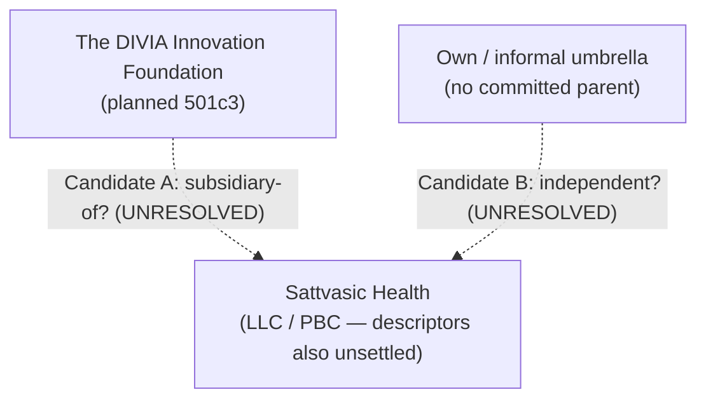

# Brief (Business) — Sattvasic Health

> **Business-side brief** → the **KSVGPS business knowledgebase** (companies / corporate structure / brands / Product Lines / Products / GTM / domains / Product Version-Releases). Self-contained (domains + cross-refs pulled in). Its **software-dev facet** (repo · techstack · Build Lines · lineage) is the paired **[engineering brief](../../../SOFTWARE_DEV/sattvasichealth.md)**. Each `##`/`###` section is bounded so it maps cleanly to a graph-DB node/edge. *(Replaces the earlier single-file `sattvasichealth.md`, whose still-valid content is migrated below; its engineering content moved to the paired brief.)*

## Identity

| Field | Value |
|---|---|
| **Product (full)** | Sattvasic Health |
| **Wordmark** | Sattvasic Health · slug/repo `sattvasichealth` · env prefix `SATTVASIC_` |
| **One-line** | A personal **health-metrics aggregator** that unifies a lifetime of scattered health data — labs, CGM, weight/DEXA, Rx/supplements, calories/macros — into one longitudinal record, with a future **correlation engine** as the payoff. |
| **Framing** | "Aggregate a lifetime of health data scattered across labs, devices, and apps into one unified, longitudinal record," then graph → trend → (future) correlate. |

## Company / corporate structure · Brands

The corporate-structure placement of this venture is a **known unresolved "question-mark" relationship** — see the dedicated section below. The candidate legal/brand entities that appear in source files:

- **Legal entity (as named in `DOMAIN_MAPPINGS.md`):** **Sattvasic Health, LLC**, captioned there as a "**Project / Subsidiary / Public Benefit Corporation**" — three layered descriptors, themselves unsettled (LLC vs. PBC, project vs. subsidiary). John's own notes refer to it as the "**Sattvasic Health Public Benefit Corporation**."
- **Brand:** product wordmark *Sattvasic Health* (no separate firm-front brand documented).
- **Umbrella (as named in `VENTURES/README.md`):** listed under "**(informal umbrella)**" — i.e. no committed corporate parent.
- **Candidate parent (the open question):** **The DIVIA Innovation Foundation** (a planned 501(c)(3) nonprofit; domain `divia.foundation`), under which `DOMAIN_MAPPINGS.md` currently nests Sattvasic Health.

## Corporate-structure question-mark relationship (UNRESOLVED — model both, commit to neither)

This venture's placement in the corporate structure is **genuinely undecided by design** — a first-class "question-mark" relationship to be modeled as *alternatives*, not collapsed to one answer. The two source files disagree, and that disagreement is **the open question itself, not a bug to fix**:

- **Candidate A — under The DIVIA Innovation Foundation.** `DOMAIN_MAPPINGS.md` nests "Sattvasic Health, LLC" beneath "The DIVIA Innovation Foundation" as a "Project / Subsidiary / Public Benefit Corporation." This matches John's recurring team discussion of whether the **Sattvasic Health PBC should be a subsidiary of the Divia Foundation** — "or how that actually works in practice and in corporate structuring/implementation."
- **Candidate B — its own / informal umbrella.** `VENTURES/README.md` lists SattvasicHealth under an "**(informal umbrella)**" with no committed parent — i.e. an independent venture outside the Foundation.

**Why it's unresolved (verbatim sense from source):** John: *"We've had multiple discussions … about what form the Sattvasic Health Public Benefit Corporation should take, whether it should be a subsidiary of the Divia Foundation, or how that actually works in practice … There are a couple of different places it could exist within the corporate structure and it's not entirely clear which one is better at this stage."* The `REVISED_ANALYSIS` re-casts this as **§A4 — "Open question (by design)": its place in the corporate structure (under the Foundation, or elsewhere) is genuinely undecided — model both candidates** (lens **L7 — open-question relationships: model alternatives, commit to none**). It is the canonical worked example of the "question-mark" graph-relationship John wants the future KingStrat AdVentureGPS system to support, so neither candidate above is finalized.

## Product Lines → Products

- **Product Line:** a single personal health-data product (no multi-product line documented).
  - **Product: Sattvasic Health.** Organized around **seven interconnected domains** (the data model is settled during Phase 00; the domains capture intended scope):
    1. **Blood & Lab Results** — normalize the same analyte (fasting glucose, HbA1c, LDL, …) across **multiple commercial labs** (Quest, LabCorp, others) onto one timeline with reference ranges and units.
    2. **CGM Data** — continuous-glucose-monitor streams (e.g. Abbott Libre); a prime correlation candidate against food logs.
    3. **Weight & Body Composition** — frequent **at-home smart-scale** data + occasional high-accuracy **DEXA** scans, merged onto one body-composition timeline (the two-source merge).
    4. **Rx & Vitamin / Supplement Management** — **refill-runway** calculations (days-of-supply remaining, when to reorder); intended integrations: **CVS** (Rx refills) and **Amazon Subscribe & Save** (supplement reordering).
    5. **Food, Calorie & Macro Tracking** — records what was eaten with calorie/macro detail, rolled up daily/weekly/monthly; **integrates with the sibling TastyPantry project** (TastyPantry specifies *what* was eaten; Sattvasic Health records calorie/macro detail). A planned-from-the-start capture path here is a **Bluetooth-connected scale paired with AI food identification**: the AI photo view identifies *what* the food is, the scale measures its *actual weight*, and the two correlate into an accurate per-portion calorie/macro estimate — deliberately **not** photo-only portion estimation (the accuracy critique behind **R-007 / "Cal AI"**). This same scale + AI-food-ID tech is the **source tech that can be white-labeled to TastyPal's TastyCal** product-line for a different (culinary, not health-first) audience — see the cross-product note below.
    6. **Device & Legacy-Data Import** — unify historical exports (Libre CGM, Quest labs, old scale/weight/BP spreadsheets, Fitbit incl. sleep stages, BP-monitor, ketone-monitor); "many 'new' sources are really import adapters for an existing export format" (with dedup).
    7. **Trends & Correlation Analysis** — the payoff layer: graphs/trends now, future **health-event correlations** (motivating example: certain foods → headaches ~2 hours later).

## Cross-product / ecosystem role (one-directional — see ERRATA)

- **Intended role:** the **"health" reader of the Divia.Network fan-out** — a single NL capture (*"I had El Pollo Loco for dinner"*) fans out from DiviaHome's Activity Log to TastyPantry (food), **Sattvasic Health (macros)**, and LegendaryMoney (expense). Sattvasic Health **consumes TastyPantry food data** for calorie/macro detail.
- ⚠️ **ERRATA E-06 (one-directional ecosystem membership).** Sattvasic Health's own README/`CLAUDE.md` call it *"a standalone project … not part of any larger platform,"* integrating **only** with TastyPantry. **LegendaryMoney and the Divia.AI venture docs name Sattvasic Health as an ecosystem sibling; Sattvasic Health does not reciprocate** — a membership to reconcile (the evidence says it is *meant* to be in the Divia.Network ecosystem; its docs lag). See [`../../../ERRATA.md`](../../../ERRATA.md).
- **Shared-tech / white-label to TastyCal (TastyPal):** the **Bluetooth-connected scale + AI-food-ID** capability planned for Sattvasic Health's Food/Calorie/Macro domain (item 5 above) is the **source tech** for a **white-labeled, TastyPal-branded** consumer app — **TastyCal (by TastyPal)** — that reaches a different (culinary) audience and benefits from TastyPal's food databases (TastyPantry inventory, taste preferences, recipes). The relationship is **same underlying scale + food-ID tech, two brand surfaces** — Sattvasic Health (health/wellness) and TastyCal (TastyPal/culinary). TastyCal is a 🔵 **potential / under-consideration** product-line, not committed. See [`../TastyPal/tastycal.md`](../TastyPal/tastycal.md) and competitive-research **R-007** (Cal AI) in [`../../../../_backlog_TODOs/RESEARCH-BACKLOG.md`](../../../../_backlog_TODOs/RESEARCH-BACKLOG.md).
- **Direction (John's current lean — primary home is here):** the scale-app's **primary / original home is the "real, health-based" version inside Sattvasic Health** — i.e. **Sattvasic Health *is* the primary home of the scale-app**, with the TastyPal white-label as a **secondary, research-gated** possibility. This lean is **reinforced if Sattvasic Health is structured as a PBC owned by the nonprofit Divia.Foundation** (Candidate A in the corporate-structure section above): a **PBC-under-the-Foundation** home strengthens the **health-first + nonprofit branding** the scale-app fits best. Note the downstream **name issue:** the TastyPal-side working title **"TastyCal" is now BLOCKED** (`tastycal.com` is registered to a third party), so the white-label — *if* pursued after further research — ships under a yet-to-be-chosen name. Net: **primary = Sattvasic Health (health-first) scale-app; secondary = the TastyPal white-label (research-gated, pending rename).**
- **Evidence behind the scale approach (Cal AI dossier):** the **first-pass third-party evidence validating the BLE-scale × AI-food-ID thesis** — why photo-only portion estimation is the broken, *random-and-uncorrectable* link, with independent builders converging on weight / precise-quantity as the fix — is captured in TastyCal's [**Cal AI competitive / accuracy dossier**](../TastyPal/tastycal.md#cal-ai-competitive--accuracy-dossier-raw-evidence--to-be-modeled-in-ksvgps-later) (→ **R-007**). It is cross-linked here because the **scale tech originates in this product** and that evidence is the justification for the scale-based approach.

## Product Version-Releases

Pre-release (Phase 00 pending; docs-only, zero application code). When releases exist, they follow the model's **immutable-past / flexible-future** rule (past = git-matched historical record; future = a movable "marketing sketch" re-bucketable like kanban cards). A documented Phase-01 first slice — **one metric domain end-to-end** (e.g. a cross-lab analyte/lab-result timeline) — is the natural first public Version-Release candidate.

## Go-to-market / strategic role

No formal GTM is documented (the product is a **personal** health aggregator, pre-code). Its strategic role in source files is as a **Divia.Network ecosystem app** — the health-domain consumer of the cross-app NL fan-out — and as one expression of the portfolio's **"implicit-data, discover-and-suggest"** brand promise (observe real behavior, surface insight; never make the user fill out a form). The weekly-correlation agent (below) is the purest health-domain instance of that promise.

## Domains (self-contained — from `DOMAIN_MAPPINGS.md` / `DOMAIN_LIST.md` / `DOMAIN_WISHLIST.md`)

- **Canonical:** **`sattvasichealth.com`** (registered May 7, 2023).
- **Redirects / aliases:** `sattvasic.com`, `sattvasic.health`, `satvasic.com`, `satvasic.health`, `satvasichealth.com`.
- **Wishlist / to-buy:** **`sattvasic.ai`** (marked `BUY-DOMAIN`; listed unregistered at ~$159.96 / 2 yr).
- **Note:** `sattvasic.health` and `satvasic.health` registered Jun 13, 2026; `satvasichealth.com` registered Sep 2, 2025. *(No GitHub remote yet — local repo only; → [engineering brief](../../../SOFTWARE_DEV/sattvasichealth.md).)*

## Ideation & Exploration (capture everything, commit to nothing)

*(Migrated from the predecessor single-file brief — high-value product ideas.)*
- **From the repo:** cross-lab analyte normalization onto one timeline (the central data-model challenge); the two-source body-composition merge (scale + DEXA); a refill-runway model; the import-adapter architecture for legacy/device sources (with dedup); the future correlation engine (foods→headaches, CGM vs food logs, sleep vs metrics); a Phase-01 first slice (one metric domain end-to-end, e.g. a lab-result timeline).
- ✦ **The recurring weekly correlation agent** (LATER-002 §6) — a weekly pass over labs/CGM/weight/macros/Rx that surfaces *hypotheses* ("sleep-quality dips follow late-eating days") as suggestions for the human and their doctor to evaluate — insights the user wouldn't think to query. The purest expression of discover-and-suggest in the health domain. *(Per ERRATA, this agent is **not** in the repo.)*
- ✦ The **refill-runway model** is the **same time-decay primitive** as DiviaHome's grocery replenishment and LegendaryMoney's scheduled outflows — build it once, reuse across all three.
- ✦ Sattvasic + TastyPantry + LegendaryMoney through one Activity Log enables cross-domain insight no single app could see ("late-night fast-food spend tracks with worst-sleep nights").
- ✦ **Close the license gap** (likely AGPL+Commercial like its siblings — *confirm*; engineering detail in the paired brief).

## Status

Phase 00 (Ideation & Research) **PENDING**; docs-only, **zero application code**. **Licensing: Undocumented** — no LICENSE file, no statement (a notable gap vs. its dual-licensed siblings; closing it is an open ideation item, likely AGPLv3 + Commercial to match siblings — *not confirmed*). **Corporate placement: unresolved** (DIVIA Foundation subsidiary vs. own/informal umbrella — see the question-mark section above). *(Engineering lineage / techstack / git topology → the [engineering brief](../../../SOFTWARE_DEV/sattvasichealth.md).)*

## Cross-references

- Paired engineering brief: [`../../../SOFTWARE_DEV/sattvasichealth.md`](../../../SOFTWARE_DEV/sattvasichealth.md).
- ERRATA (E-06 ecosystem-membership; E-09 lineage self-report disagreement): [`../../../ERRATA.md`](../../../ERRATA.md).
- Ecosystem context: `../../VENTURES/DiviaAI.md` (Divia.Foundation + the Divia.Network fan-out); `../../USER_STORIES/divia-network-fanout.md`.
- **White-label / shared scale tech:** [`../TastyPal/tastycal.md`](../TastyPal/tastycal.md) (TastyCal product brief) · competitive-research **R-007** (Cal AI) in [`../../../../_backlog_TODOs/RESEARCH-BACKLOG.md`](../../../../_backlog_TODOs/RESEARCH-BACKLOG.md).
- Model: [`../../../PROJECT-ORGANIZATION-MODEL.md`](../../../PROJECT-ORGANIZATION-MODEL.md) (the question-mark / L7 open-question relationship).
