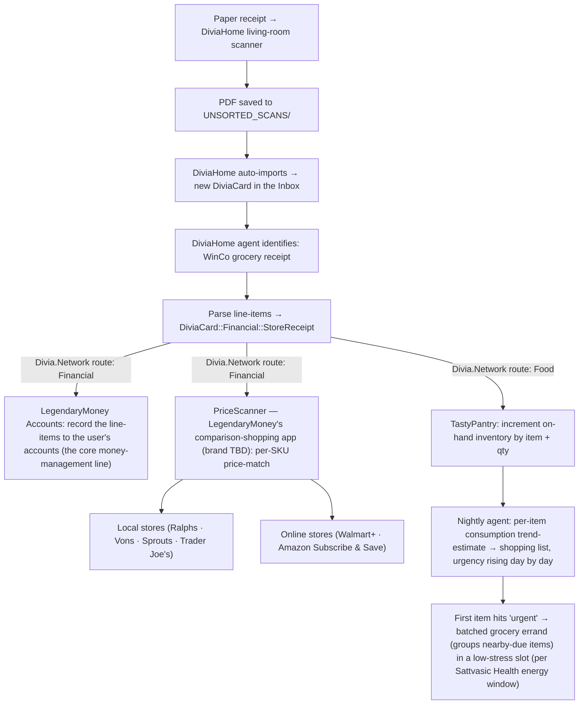

# Workflow — Cross-Venture Future-Scenario Reasoning

> Rough-draft v1 (2026-06-21). Downstream sibling of [`workflow_new_venture_intro_brief.md`](workflow_new_venture_intro_brief.md): once ventures are modeled, reason about a future point-in-time *across all of them at once*. Assumes the dated-Triangulation-Target field from [`../_REFERENCE/PROJECT-ORGANIZATION-MODEL.md`](../_REFERENCE/PROJECT-ORGANIZATION-MODEL.md).

## Purpose

Answer questions of the form *"In January 2030, &lt;everyday scenario&gt; — what happens?"* by projecting the whole portfolio forward to that date and reasoning, wildly and imaginatively, about how the ventures' then-current features interlock. The output feeds **both directions in time**: forward (a richer picture of what each venture's future version does) and backward (the backlog steps needed to get there — literally triangulating the path to the Target).

## Prerequisite — dated targets

Every Build Line / Triangulation Target / major milestone carries a **frequently-updated absolute-date estimate** ("in 36 months" → e.g. `2029-Q2`), revised every planning pass as milestones move and `v1→v2→v3` re-sequence. Today these dates live in the markdown briefs; once modeled in the graph-DB they make the portfolio **sliceable by date**.

## The steps

1. **Pick a date + a scenario** — a "Day-in-the-Life" user-story snapshot, evaluated at ±3 months around the date.
2. **Request a scoped projection** — "the state of every venture / feature as of {date}." Today: read the briefs' dated milestones. Eventually: a **SQL-slice across the graph-DB** returning "all features expected live by {date}," auto-scoped to the scenario. (The markdown read is the poor-man's stand-in; the graph-DB scoped-projection is the endpoint.)
3. **Brainstorm the interplay** — reason imaginatively across the projected features; chase the cross-venture chains end-to-end (the receipt example below).
4. **Write conclusions back** — as new facts on each venture's future version (forward), and as backlog items across NEXT/LATER/SOMEDAY → Stages→Phases→Sprints that build toward them (backward). Research gaps → [`../_backlog_TODOs/RESEARCH-BACKLOG.md`](../_backlog_TODOs/RESEARCH-BACKLOG.md). Each run thus *upgrades* the briefs, so the next run reasons from a richer base — the feedback loop.

## Worked example — "I went grocery shopping at WinCo; what happens to the paper receipt?" (DiviaHome, Jan 2030)

**Modeling approach the diagram illustrates** (the real point of this example): when a routed item has several downstream uses, **decompose it — branch out each distinct consumer and use — rather than collapsing them into one box.** Here the single receipt fans into LegendaryMoney *Accounts* (record the spend) **and** its *PriceScanner* comparison-shopping app (brand TBD), which itself fans into *local* vs. *online* store price-matches — plus TastyPantry on the Food route. Branching the uses out is how the cross-venture value becomes visible; collapsing it into "LegendaryMoney does finance stuff" hides exactly the interplay we're reasoning about. Future Claude instances running this workflow should default to this **fan-out decomposition**.

The trend logic is the interesting part: an item goes on the list at **half-package remaining** as "needed within ~10 days," and the urgency **escalates daily** toward the consumption trend-estimate (itself revised nightly by whether the household ate as predicted). The estimate accounts for household rules (e.g. "the after-school nanny makes the kids quesadillas") — so on the day the last tortillas would run out, tortillas become an **URGENT-today** task, while the cheese (not itself urgent, but within its shelf-life window) is **batched into the same trip**. The goal is one or two conveniently-scheduled weekly trips that clear "needed within 3 days" items *before* any of them interrupt the day — not panic runs.

This single scenario exercises **five ventures at their Jan-2030 versions** (DiviaHome scanner + Inbox + agents; Divia.Network routing; DiviaCards typed cards; LegendaryMoney; TastyPantry; Sattvasic Health) — and every imaginative branch is either a new feature-fact to write onto those ventures' future versions or a backlog item on the path to them.

## Cross-references

- Dated targets + the by-date slice: [`../_REFERENCE/PROJECT-ORGANIZATION-MODEL.md`](../_REFERENCE/PROJECT-ORGANIZATION-MODEL.md) (*Dated Triangulation Targets & future-scenario projection*).
- Upstream sibling (how ventures get modeled in the first place): [`workflow_new_venture_intro_brief.md`](workflow_new_venture_intro_brief.md).
- The Divia.Network fan-out pattern this example rides on: [`../_REFERENCE/ULTIMATE_VISION/USER_STORIES/divia-network-fanout.md`](../_REFERENCE/ULTIMATE_VISION/USER_STORIES/divia-network-fanout.md).
